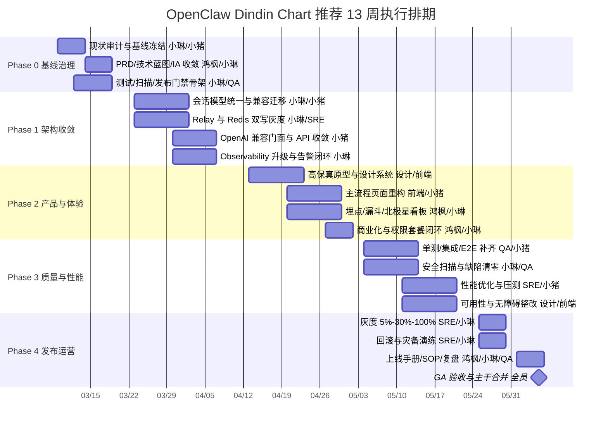

# OpenClaw Dindin Chart 端到端落地路线图

> 基线日期：2026-03-08
> 基线提交：`cbdda51`
> 适用范围：`chat-hub`、`chat-web`、部署与运维链路
> 产出目的：替代过期的 [`IMPLEMENTATION_PLAN.md`](./IMPLEMENTATION_PLAN.md)，作为执行期单一事实来源
> Phase 0 明细：见 [`PHASE0_EXECUTION_CHECKLIST.md`](./PHASE0_EXECUTION_CHECKLIST.md)

## 1. 结论摘要

原始 [`IMPLEMENTATION_PLAN.md`](./IMPLEMENTATION_PLAN.md) 只覆盖了 6 个技术点，并将整体工作量估算为 3 小时，这与当前仓库实际规模不符。当前代码库已经不是“从零接入 Relay、Session 优化、Observability、Agent API”的状态，而是“多套实现并存、文档与代码漂移、质量门禁不足”的状态。

当前最重要的判断：

| 主题 | 原文档判断 | 当前代码库真实状态 | 执行建议 |
|---|---|---|---|
| RelayService | “代码存在，未集成” | 已在 [`chat-hub/src/server.ts`](../src/server.ts) 初始化并挂载 `/api/relay`；数据库迁移 [`016_relay_service.sql`](../migrations/016_relay_service.sql) 已存在 | 不做“从零集成”，改做“Redis 双写收敛 + 端口/拓扑统一 + 灰度切流” |
| Session ID / 切片 / 压缩 | “未开始” | [`chat-hub/src/agent/session-manager-v2.ts`](../src/agent/session-manager-v2.ts) 与 [`024_session_optimization.sql`](../migrations/024_session_optimization.sql) 已实现规范 ID、切片、压缩表 | 不做新建功能，改做“统一会话模型、补兼容迁移、把压缩从占位算法升级为生产级摘要” |
| Agent API 暴露 | “代码存在，未暴露” | [`chat-hub/src/routes/agents-v2.ts`](../src/routes/agents-v2.ts) 已挂载 `/api/agents`，包含 `chat`、`chat/stream`、`sessions`、`resume`、`api-token` | 不重复造轮子；如需 OpenAI 外部兼容，仅补 `/v1/*` 适配层 |
| 可观测性 | “未开始” | [`chat-hub/src/observability/index.ts`](../src/observability/index.ts)、[`chat-hub/src/routes/observability.ts`](../src/routes/observability.ts)、[`chat-web/src/views/ObservabilityDashboard.vue`](../../chat-web/src/views/ObservabilityDashboard.vue) 已存在 | 不做基础版；直接升级到 Prometheus/OpenTelemetry/告警闭环 |
| UI 设计系统 | 原文档未覆盖 | [`chat-web/src/styles/brand.css`](../../chat-web/src/styles/brand.css) 已定义品牌 token 与暗色模式；[`chat-web/src/styles/global.css`](../../chat-web/src/styles/global.css) 又有一套全局规则 | 先统一 token 层，再做高保真改版与组件抽象 |
| 测试与质量 | 原文档仅口头验收 | [`chat-hub/tests/jest.config.js`](../tests/jest.config.js) 覆盖率门槛只有 50%，且 `collectCoverageFrom` 仍指向 `src/**/*.js`；前端 `chat-web/package.json` 无测试脚本 | Phase 0 必须先建立测试、扫描、压测与发布门禁 |

本项目当前真正的问题不是“功能缺失”，而是以下 5 类执行风险：

1. 文档与实现漂移：README、测试配置、实施文档仍按 `index.js/server.js` 和旧架构描述，但当前主干已以 TS 与 V2 路由为主。
2. 架构双轨：Redis 仍承担发布通知，Relay 只是可选旁路，且 `docker-compose.yml` 把宿主机 `8274` 给了第二个 `chat-hub`，而 [`chat-hub/src/server.ts`](../src/server.ts) 又把 Relay 默认端口设为 `8274`。
3. 质量门禁缺失：仓库内未发现 `sonar-project.properties`、ZAP、Lighthouse、前端测试配置，CI 只有镜像构建。
4. 会话模型分叉：[`chat-hub/src/session-manager.ts`](../src/session-manager.ts) 管理聊天会话元数据，[`chat-hub/src/agent/session-manager-v2.ts`](../src/agent/session-manager-v2.ts) 管理 agent session；缺少统一边界。
5. 前后端 API 漂移：例如 [`chat-web/src/api/observability.js`](../../chat-web/src/api/observability.js) 暴露了 `getSystemInfo()`，但 [`chat-hub/src/routes/observability.ts`](../src/routes/observability.ts) 并没有 `/system` 路由。

## 2. 更合理的总体策略

相较于原文档，建议采用以下 4 条执行原则：

1. 先收敛，再扩展。先统一会话、路由、观测、部署拓扑，再做商业化与体验增强。
2. 先建立基线，再承诺指标。P99、覆盖率、留存率、付费率必须先采集基线值，再以绝对时间窗口考核。
3. 关键链路 90%，全仓库分阶段提升。当前仓库测试门槛只有 50%，直接要求全仓库 90% 会拖垮交付。建议以关键链路自动化覆盖率 `>= 90%` 为发布门槛，仓库总体覆盖率阶段性提升到 `80% -> 85% -> 90%`。
4. 兼容层优于重写。对外 OpenAI 协议兼容建议建立 `/v1/chat/completions` 门面，内部复用 `agents-v2`，避免复制对话逻辑。

## 3. 排期与资源

### 3.1 推荐排期

- 推荐版本：`13 周`，时间区间 `2026-03-09` 至 `2026-06-05`
- 推荐投入：`6.0 ~ 6.5 FTE`
- 适用前提：增加设计、QA、DevOps 共用资源

### 3.2 保守排期

- 若仅按现有 3 人核心团队推进：建议放宽到 `18 ~ 20 周`
- 保守原因：当前前端缺测试、后端文档漂移严重、质量门禁需从零补齐

### 3.3 资源配置

| 角色 | Owner | FTE | 主要职责 |
|---|---|---:|---|
| 产品负责人 | 鸿枫 | 0.5 | PRD、优先级、商业化策略、验收拍板 |
| 技术负责人 | 小琳 | 1.0 | 架构收敛、技术路线、质量门禁、上线把关 |
| 全栈工程师 | 小猪 | 1.0 | 后端实现、前端联调、测试修复 |
| 前端工程师/设计实现 | 新增或共享资源 | 1.0 | 设计系统、组件重构、高保真还原、无障碍 |
| UI/UX 设计师 | 新增或共享资源 | 1.0 | Figma/Sketch、原型、可用性测试 |
| QA 自动化 | 新增或共享资源 | 1.0 | 单元、集成、E2E、回归、缺陷闭环 |
| DevOps/SRE | 新增或共享资源 | 0.5 | 灰度、回滚、监控、灾备、压测 |

## 4. 可视化甘特图

## 5. 分阶段实施路线图

### Phase 0：基线治理与执行准备（2026-03-09 ~ 2026-03-20）

目标：冻结基线、统一文档、补齐质量骨架，把“现在到底是什么状态”说清楚。

核心工作：

- 冻结执行基线：以 `cbdda51` 为起点，建立执行分支并要求后续需求先过 RFC/设计评审。
- 文档收敛：更新 README、API 文档、实施计划，废弃 `server.js/index.js` 等旧描述。
- 测试门禁搭建：修复 Jest 覆盖范围从 `src/**/*.js` 到真实 TS/JS 源；增加前端测试框架和 Playwright 冒烟流。
- 工具链接入：新增 SonarQube、OWASP ZAP、Lighthouse、ESLint/TypeScript、依赖漏洞扫描。
- 指标基线：采集当前 API 延迟、错误率、内存、页面加载、关键任务完成率、留存与付费漏斗基线。

交付物：

- `PRD v1.0`
- `技术架构蓝图 v1.0`
- `接口清单与兼容矩阵`
- `质量门禁配置`
- `基线评估报告`

验收标准：

- README、架构图、接口文档与当前代码一致
- 后端、前端、E2E、扫描都能在 CI 中执行
- 基线报告覆盖 API、前端、质量、业务四类指标

风险与预案：

| 风险 | 影响 | 预案 |
|---|---|---|
| 工作树持续漂移 | 基线无效 | 进入 Phase 1 前冻结主干、按 RFC 合入 |
| TS/JS 混合导致测试配置混乱 | 覆盖率失真 | 统一 `ts-jest` 或编译后测试策略 |
| 旧脚本依赖手工启动服务 | CI 不稳定 | 用 Docker Compose Test Profile 或一键本地测试环境 |

### Phase 1：架构收敛与平台稳定（2026-03-23 ~ 2026-04-10）

目标：把 Relay、Session、Agent、Observability 收敛成一套可信底座。

核心工作：

- 会话模型统一：
  - 保留 [`chat-hub/src/session-manager.ts`](../src/session-manager.ts) 处理用户/群组会话。
  - 保留 [`chat-hub/src/agent/session-manager-v2.ts`](../src/agent/session-manager-v2.ts) 处理 agent session。
  - 新增统一会话域文档和 `session_type/domain` 映射，避免混用。
  - 补老数据兼容迁移与回填脚本。
- Relay 收敛：
  - 先做 `Redis + Relay` 双写，记录投递成功率与延迟。
  - 梳理端口：将 Relay 默认端口从 `8274` 调整为独立配置项，例如 `8384`，避免与 `docker-compose.yml` 冲突。
  - 灰度切换 Pub/Sub 来源，不直接“一刀切去 Redis”。
- Agent API 收敛：
  - 复用 [`chat-hub/src/routes/agents-v2.ts`](../src/routes/agents-v2.ts) 作为内部标准实现。
  - 如需外部 OpenAI 兼容，增加 `/v1/chat/completions` 和 `/v1/models` facade，仅做协议转换。
- 可观测性升级：
  - 在现有 [`chat-hub/src/observability/index.ts`](../src/observability/index.ts) 上补 Prometheus/OpenTelemetry 导出。
  - 统一 `request_id / session_id / agent_id / user_id` 四元组。
  - 修复前后端 API 漂移，例如 `/observability/system` 缺失问题。

交付物：

- `架构收敛设计稿`
- `兼容迁移脚本`
- `OpenAI Facade API 文档`
- `Observability 数据字典`

验收标准：

- 关键会话 API 全量兼容，老 session 可回放
- Relay 双写成功率 `>= 99.9%`
- 关键日志字段可按 `request_id/session_id/agent_id/user_id` 检索
- `/api/agents` 与 `/v1/*` facade 契约测试通过

### Phase 2：UI/UX 与产品业务闭环（2026-04-13 ~ 2026-05-01）

目标：把“能用的后台”升级成“可转化、可复用、可衡量的协作产品”。

核心工作：

- 信息架构重构：围绕 `协作空间 / 枫语私语 / 智能体 / 技能中心 / MCP / 任务 / 工作空间 / 可观测性` 重排导航优先级。
- 高保真原型：输出 Figma 或 Sketch，覆盖首页、登录注册、智能体列表/详情、Agent Chat、任务协作、可观测性、计费与权限。
- 设计系统：统一色彩、排版、间距、圆角、阴影、动效、暗色模式、组件状态。
- 埋点与漏斗：完成事件体系、漏斗、看板、告警。
- 商业化：把免费体验、专业版、团队版、企业版的功能边界和升级路径落到 UI 与后端权限模型。

交付物：

- `Figma/Sketch 高保真源文件`
- `设计系统规范 v1.0`
- `埋点字典 v1.0`
- `套餐与权限矩阵`
- `可用性测试报告 Round 1`

验收标准：

- 关键页面都有交互原型、切图规范与组件说明
- 高优主流程任务完成率 `>= 95%`
- 误操率 `< 3%`
- 核心漏斗可实时查看，异常可告警

### Phase 3：质量、安全、性能收口（2026-05-04 ~ 2026-05-22）

目标：让“可演示”进入“可上线”。

核心工作：

- 静态扫描：SonarQube 阻断问题清零；重复率压到 `< 5%`
- 动态安全：ZAP/DAST 覆盖登录、权限、文件上传、消息发送、Agent API
- 回归自动化：单元 + 集成 + E2E 覆盖主流程、异常流、边界流
- 性能优化：
  - 建立 API、数据库、SSE、前端 bundle 基线
  - 核心接口 P99 下降 `>= 30%`
  - 24 小时 soak test 无持续堆内存增长
  - 前端 bundle 下降 `>= 20%`
- 无障碍：达到 WCAG 2.1 AA

交付物：

- `测试报告`
- `安全扫描报告`
- `压测报告`
- `无障碍审计报告`
- `重构清单关闭报告`

验收标准：

- `P0 = 0`
- `P1` 缺陷关闭率 `>= 95%`
- 关键链路自动化覆盖率 `>= 90%`
- 核心域单测覆盖率 `>= 80%`
- ERROR 日志归零或具备明确白名单说明

### Phase 4：灰度发布与运维闭环（2026-05-25 ~ 2026-06-05）

目标：完成上线、可回滚、可演练、可复盘。

核心工作：

- 灰度：
  - `0%` 内部员工与测试租户
  - `5%` 小流量真实用户
  - `30%` 扩容验证
  - `100%` 全量切换
- 回滚：
  - 保持应用、数据库、配置三层回退脚本
  - 版本回退 `<= 3 分钟`
- 灾备：
  - RPO `<= 5 分钟`
  - RTO `<= 15 分钟`
  - 至少一次全链路桌面演练 + 一次实操演练
- 运维：
  - 指标、日志、告警、看板、值班、升级公告、SOP

交付物：

- `上线手册`
- `运维 SOP`
- `灰度与回滚演练记录`
- `灾备演练报告`
- `GA 复盘文档`

验收标准：

- 灰度各阶段无新增 P0/P1
- 回滚演练 2 次连续通过
- 灾备演练满足 RPO/RTO
- 监控告警命中率与值班响应闭环通过验收

## 6. UI/UX 方案

### 6.1 用户画像

| 用户类型 | 目标 | 高频任务 | 主要痛点 |
|---|---|---|---|
| 协作发起人 | 快速拉起协作空间并调度 Agent | 创建项目、拉群、分配任务、查看进度 | 信息分散、权限复杂、路径过深 |
| 一线协作者 | 在消息、任务、文件、Agent 间顺滑切换 | 发消息、收私信、追任务、查看文件 | 状态切换频繁、反馈不及时 |
| Agent 构建者 | 快速创建、调优、接入和追踪 Agent | 建 Agent、看会话、看 token、查错误 | 配置复杂、缺调试闭环 |
| 管理员/运营 | 观测系统健康和业务指标 | 查日志、看告警、看转化、处理异常 | 指标分散、缺统一看板 |

### 6.2 高保真原型范围

Figma 页面建议：

1. `00-Brand Foundations`
2. `01-Global Navigation`
3. `02-Auth & Onboarding`
4. `03-Collab Space`
5. `04-Agent Marketplace & Detail`
6. `05-Agent Chat & Session Replay`
7. `06-Task + Workspace`
8. `07-Observability & Monitoring`
9. `08-Pricing / Billing / Permissions`
10. `09-Responsive & Dark Mode`

建议输出物：

- 设计源文件：Figma 主文件或 Sketch 源文件
- 导出资源：SVG + 3x PNG 双轨
- 设计说明：状态、边界、空态、错误态、加载态
- 交互标注：动效时长、响应阈值、导航规则

### 6.3 设计系统

基于现有 [`chat-web/src/styles/brand.css`](../../chat-web/src/styles/brand.css) 继续演进，但需要统一为 token-first 结构：

| 层级 | 规范 |
|---|---|
| 色彩 | 以 `fenlin-primary / secondary / accent / neutral / semantic` 五层体系重组，保留品牌红金绿 |
| 字体 | 放弃系统字体混用，统一 `HarmonyOS Sans SC` 或 `Source Han Sans SC` 为正文，`IBM Plex Sans` 用于数据/控制台 |
| 间距 | `4 / 8 / 12 / 16 / 24 / 32 / 48 / 64` |
| 圆角 | `8 / 12 / 16 / 24`，与品牌文档一致 |
| 阴影 | 统一为 `elevation-1 ~ elevation-4`，禁页面自定义 box-shadow |
| 组件库 | Element Plus 保留，但统一包裹为 `Fenlin*` 二次封装组件 |
| 响应式 | `xs < 480`, `sm 480-767`, `md 768-1023`, `lg 1024-1439`, `xl >= 1440` |
| 动效 | `150 / 200 / 240 / 300ms`，统一 `cubic-bezier(0.4, 0, 0.2, 1)` |

### 6.4 可用性测试方案

测试对象：`12~15` 名用户，覆盖 4 类画像，每轮 3~4 人。

测试任务：

1. 注册并完成首次进入协作空间
2. 创建 Agent 并发起首次对话
3. 查看历史会话并恢复中断会话
4. 创建任务并绑定工作空间文件
5. 进入可观测性面板定位一个错误
6. 完成套餐升级或试用开通

关键指标：

- 任务完成率 `>= 95%`
- 误操率 `< 3%`
- SUS `>= 80`
- 首次成功率 `>= 85%`
- 平均恢复路径步数下降 `>= 30%`

迭代计划：

- Round 1：信息架构与导航
- Round 2：Agent Chat、任务、可观测性
- Round 3：付费与设置、深色模式、无障碍

## 7. 产品业务闭环

### 7.1 核心业务流

1. 获客：官网/文档/社群/邀请进入注册
2. 激活：创建空间 -> 配置 Agent -> 首次对话成功
3. 留存：任务协作、私信、工作空间、通知与复用
4. 转化：触发高级 Agent、可观测性、团队权限、API 配额
5. 扩张：邀请成员、创建项目群、复用技能与 MCP

### 7.2 北极星与核心指标

| 层级 | 指标 | 目标 |
|---|---|---:|
| 北极星 | 周活跃协作空间数 | 周环比持续增长 |
| 激活 | 注册后 24h 内完成“创建 Agent + 首次对话”占比 | `>= 55%` |
| 留存 | 次日留存 | `>= 35%` |
| 留存 | 7 日留存 | `>= 18%` |
| 变现 | 付费转化率 | `>= 5%` |
| 变现 | 付费账户 30 日留存 | `>= 75%` |
| 质量 | 核心流程成功率 | `>= 99.5%` |

### 7.3 漏斗设计

至少 5 层漏斗：

| 漏斗 | 层级 |
|---|---|
| 注册激活漏斗 | 访问 -> 注册 -> 认证通过 -> 创建空间 -> 首次对话成功 |
| Agent 配置漏斗 | 打开 Agent 页 -> 创建 Agent -> 填配置 -> 测试成功 -> 保存发布 |
| 会话留存漏斗 | 首次对话 -> 次日回访 -> 查看历史 -> 恢复会话 -> 创建任务 |
| 团队协作漏斗 | 创建项目 -> 邀请成员 -> 分配任务 -> 上传文件 -> 任务完成 |
| 付费转化漏斗 | 触达权益 -> 打开套餐页 -> 开启试用 -> 支付成功 -> 7 日留存 |

### 7.4 埋点方案

事件总数要求：`>= 50`。建议首版定义 64 个事件，按域分组：

| 事件域 | 事件名 |
|---|---|
| 认证 8 个 | `auth_register_submit`, `auth_register_success`, `auth_register_fail`, `auth_login_submit`, `auth_login_success`, `auth_login_fail`, `auth_logout`, `auth_refresh_token` |
| 入门 8 个 | `onboarding_start`, `onboarding_skip`, `onboarding_complete`, `workspace_create_click`, `workspace_create_success`, `workspace_invite_click`, `workspace_invite_success`, `workspace_first_message` |
| Agent 12 个 | `agent_list_view`, `agent_create_click`, `agent_create_success`, `agent_create_fail`, `agent_edit_save`, `agent_delete`, `agent_duplicate`, `agent_auto_connect_open`, `agent_auto_connect_success`, `agent_detail_view`, `agent_chat_start`, `agent_chat_success` |
| 会话 8 个 | `session_create`, `session_resume`, `session_replay_view`, `session_message_send`, `session_message_receive`, `session_summary_view`, `session_delete`, `session_export` |
| 任务/项目 8 个 | `project_create`, `project_view`, `task_create`, `task_assign`, `task_status_change`, `task_complete`, `workspace_file_upload`, `workspace_file_open` |
| 可观测性 8 个 | `observability_dashboard_view`, `observability_log_filter`, `observability_metric_filter`, `observability_alert_open`, `monitoring_incident_ack`, `monitoring_incident_resolve`, `system_health_view`, `error_log_zero_day` |
| 商业化 6 个 | `pricing_view`, `pricing_plan_select`, `trial_start`, `payment_submit`, `payment_success`, `payment_fail` |
| 设置与体验 6 个 | `theme_change`, `dark_mode_enable`, `shortcut_edit`, `notification_toggle`, `accessibility_mode_enable`, `feedback_submit` |

告警规则：

- 任意关键漏斗转化率环比下降 `> 20%` 自动告警
- 关键事件 5 分钟无上报告警
- 付费漏斗支付失败率 `> 3%` 告警

## 8. 缺陷修复与质量治理

### 8.1 静态与动态扫描

| 项目 | 当前状态 | 目标 |
|---|---|---|
| SonarQube | 未接入 | 阻断问题清零、重复率 `< 5%` |
| OWASP ZAP | 未接入 | OWASP Top 10 零高危 |
| Dependency Scan | 未形成门禁 | 高危依赖 0 |
| 日志审计 | 有可观测性基础，无 ERROR 清零流程 | ERROR 日志日清机制 |

### 8.2 Bug 生命周期

流程：`发现 -> 分级 -> 定位 -> 修复 -> 回归 -> 复盘`

SLA：

- P0：4 小时内止血，24 小时内修复，48 小时内复盘
- P1：24 小时内修复，72 小时内复盘
- 常规缺陷：`<= 3 天` 完成闭环

### 8.3 自动化回归用例

至少覆盖：

- 登录、注册、找回密码、权限校验
- 创建 Agent、更新 Agent、流式对话、断点恢复
- 会话切片、压缩、删除、导出
- 任务创建、分配、完成
- 文件上传、下载、预览
- 可观测性查询、健康检查、告警确认
- 支付试用、套餐切换、额度校验

## 9. 代码与逻辑优化

### 9.1 重构清单

1. 抽离统一 `session domain service`，明确用户会话与 agent session 的边界。
2. 将 `/api/agents/:id/chat` 与未来 `/v1/chat/completions` 复用同一 service，避免重复路由逻辑。
3. 提取统一 `api-client/error-mapper/request-context` 中间件。
4. 将前端全局样式收敛到 token 层，禁止页面级硬编码颜色和阴影。
5. 对 `AgentCard/AgentConfig/TaskBoard/FileManager` 建立公共设计规范与测试夹具。

### 9.2 性能优化目标

| 维度 | 基线动作 | 目标 |
|---|---|---|
| API | 采集 P50/P95/P99 | 核心接口 P99 降低 `>= 30%` |
| DB | 分析慢查询、索引命中 | 热点查询 `< 100ms` |
| 内存 | 24h soak test | 无持续性泄漏，堆增长趋稳 |
| Bundle | 分析路由分包与依赖 | 入口 bundle 缩小 `>= 20%` |
| SSE/流式 | 连接数、断线率、重连率 | 断流率 `< 0.5%` |

建议优先级：

1. 先做指标采集和 Profiling
2. 再做索引与接口缓存
3. 最后做前端分包与 UI 性能

## 10. 设计与交互优化

### 10.1 Nielsen 10 原则逐条评估

| 原则 | 当前判断 | 改进动作 |
|---|---|---|
| 系统状态可见 | 有 Dashboard，但主流程反馈不足 | 所有异步动作增加状态条、进度与 toast 规范 |
| 贴近现实世界 | 品牌文案已存在，但后台术语偏工程化 | 将 “chat/session/agent api token” 映射为面向用户语言 |
| 用户可控可撤销 | 会话/任务/配置可撤销能力弱 | 增加撤销、草稿、回滚记录 |
| 一致性与标准 | 路由和样式双轨并存 | 建立命名、组件、交互统一规范 |
| 防错 | 配置页参数易错 | 表单约束、默认值、实时校验、风险确认 |
| 识别优于回忆 | 导航层级深 | 引入命令面板、最近访问、上下文入口 |
| 灵活高效 | 高阶用户缺快捷流 | 补快捷键、批量操作、模板 |
| 极简设计 | 页面模块堆叠较多 | 拆主次区域、减少一次呈现密度 |
| 错误恢复 | 错误消息偏技术化 | 统一错误文案与恢复建议 |
| 帮助与文档 | 有 README/教程，但产品内帮助弱 | 产品内引导、空态提示、FAQ、交互帮助 |

### 10.2 WCAG 2.1 AA

必做项：

- 颜色对比度 `>= 4.5:1`
- 可键盘全操作
- 焦点态可见且统一
- 表单具备 label、hint、error 文案
- 图标按钮提供 `aria-label`
- 图表提供文本替代说明
- 动效支持“减少动态效果”开关

### 10.3 微交互规范

- 页面进入：`200-240ms` 淡入 + 位移
- 弹窗/抽屉：`240ms`
- 按钮反馈：`150ms`
- 列表重排：`200ms`
- SSE/流式消息：逐段显现，避免字符级抖动

## 11. UI 优化

明确要求：

- 对齐品牌 VI：以枫叶红、秋金黄、自然绿为主，避免页面自行造色
- 统一圆角、阴影、留白：只允许使用设计 token
- 深色模式：与亮色模式同等优先级验收
- 资源规范：图标优先 SVG，营销位同时保留 3x PNG
- 响应式断点：`xs/sm/md/lg/xl`
- 核心页面优先做移动端与桌面双稿：登录、Agent Chat、任务、可观测性

## 12. 功能完整性保障

### 12.1 功能验收清单

必须逐条自测：

- 主流程：注册 -> 创建空间 -> 创建 Agent -> 首次对话 -> 查看历史 -> 创建任务 -> 上传文件 -> 查看观测
- 异常流：API key 无效、权限不足、网络断开、SSE 重连失败、文件上传中断、支付失败
- 边界流：超长消息、超大文件、会话超过压缩阈值、多标签页、多 Agent 并发

### 12.2 发布方案

- 内部灰度：团队成员、测试租户
- 外部灰度：`5% -> 30% -> 100%`
- 回滚方案：应用回滚、配置回滚、数据库回滚分别演练
- 灾备方案：主从数据复制、定期备份、故障切换剧本

## 13. 交付物与验收门槛

| 阶段 | 交付物 | 验收门槛 |
|---|---|---|
| Phase 0 | `PRD`、技术蓝图、基线评估、CI 门禁配置 | 文档与代码一致，测试/扫描可跑通 |
| Phase 1 | 兼容迁移、会话域文档、OpenAI facade、Observability 字典 | 核心 API 契约稳定，双写与告警可用 |
| Phase 2 | 高保真原型、设计系统、埋点字典、漏斗看板 | 任务完成率 `>= 95%`，误操率 `< 3%` |
| Phase 3 | 测试报告、安全报告、压测报告、无障碍报告 | 关键链路自动化覆盖 `>= 90%`，`P0 = 0` |
| Phase 4 | 上线手册、运维 SOP、灰度/回滚/灾备报告 | 回滚 `<= 3 分钟`，RPO/RTO 达标 |

## 14. 对原始文档的替代建议

[`IMPLEMENTATION_PLAN.md`](./IMPLEMENTATION_PLAN.md) 不应继续作为执行计划直接使用，建议保留为历史输入，并标注“仅供背景参考”。后续统一以本文件为准，并在每个 Phase 结束后更新：

- 已完成事项
- 指标实际值
- 风险变化
- 是否调整排期/资源

## 15. 本轮建议的下一步

1. 先完成 Phase 0 的“文档与基线冻结”，否则后续任何排期都会继续失真。
2. 把 Relay 与 Redis 的关系从“替代”改成“观测驱动的双写切流”，避免直接引入系统性风险。
3. 不要先追求全仓库 90% 覆盖率；优先让关键链路 90%、核心域 80%，再向全仓库推进。
4. 把 Figma/Sketch、测试报告、压测报告、SOP 作为 Phase 交付，不要在需求阶段误认为本轮已完成。
