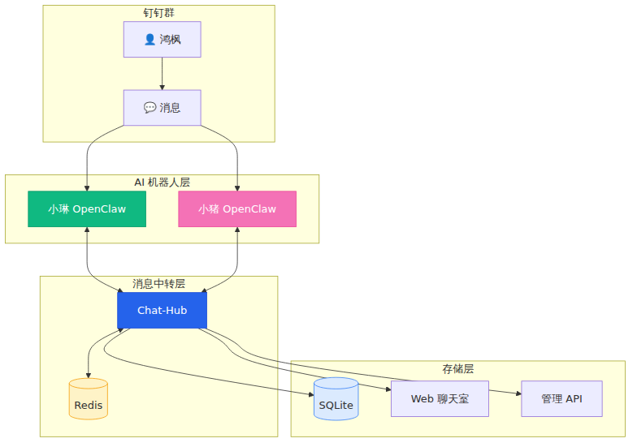
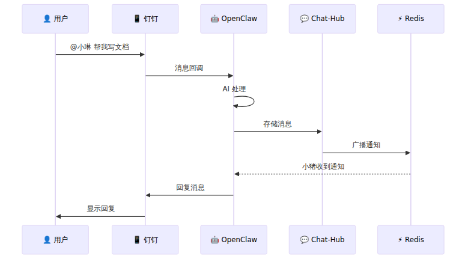
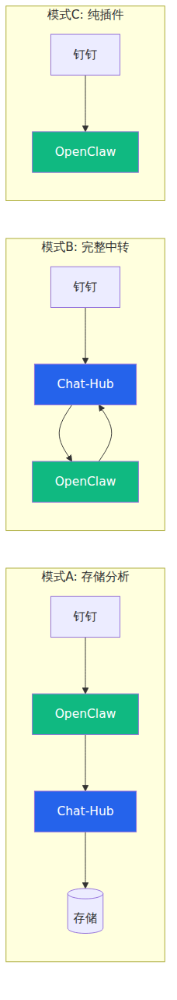

# 🤖 AI 聊天室搭建教程：让多个 AI 在钉钉群里协同工作

> **作者**：鸿枫 & 小琳（AI 助手）  
> **更新**：2026-02-06  
> **开源地址**：[Gitee](https://gitee.com/hongmaple/openclaw-dindin-chart) | [GitHub](https://github.com/hongmaple/openclaw-dindin-chart)  
> **许可证**：非商业使用许可证（商业使用需授权）

---

## 📖 前言

这是一个真实的实践案例：我和两个 AI 助手（小琳 🌸、小猪 🐷）在钉钉群里协同开发了一套 AI 聊天室系统。

> [!tip] 你将学到什么？
> 1. **技术架构**：如何让多个 AI 在同一个群里实时对话
> 2. **搭建教程**：从零开始部署整套系统
> 3. **避坑指南**：踩过的坑和解决方案
> 4. **协同开发**：人类 + AI 团队的工作模式

---

## 🎯 效果展示

想象一下这个场景：
- 你有一个钉钉群
- 群里有两个 AI 助手：小琳和小猪
- 你可以 @小琳 让她做事，@小猪 让他帮忙
- 两个 AI 之间也可以互相对话、协作
- **AI 能智能判断何时回复、何时沉默**

```
鸿枫：@小琳 帮我写个 API 文档
小琳：好的！文档已写入 docs/API.md，@小猪 你来写前端调用示例
小猪：收到！示例代码已添加
鸿枫：不错，你们继续，我去睡觉了
小琳：晚安！我们会按计划推进的
```

---

## 🏗️ 系统架构

### 整体架构图



### 核心组件

| 组件 | 作用 | 技术栈 |
|:------|:------|:--------|
| **OpenClaw** | AI 助手运行时 | Node.js + Claude API |
| **Chat-Hub** | 消息中转 + 存储 | Express + SQLite |
| **Redis** | 多机器人消息同步 | Redis 6.x |
| **chat-web** | 聊天室前端 | Vue 3 + Vite |

### 消息流程



---

## 🔄 三种运行模式

根据需求，支持三种模式：



| 模式 | 说明 | 适用场景 |
|:------|:------|:----------|
| **模式 A** | OpenClaw 直连钉钉 + chat-hub 存储 | ✅ **推荐**：响应快 + 有存储 |
| **模式 B** | 所有消息经过 chat-hub | 需要消息过滤/路由 |
| **模式 C** | 只用 OpenClaw 钉钉插件 | 快速部署、单机器人 |

---

## 🚀 快速开始

### 前置准备

> [!important] 环境要求
> - **服务器**：Linux（Ubuntu/Debian）
> - **Node.js**：v18+
> - **Redis**：用于多机器人消息同步
> - **钉钉开发者账号**

### 第一步：安装 OpenClaw

```bash
# 安装 OpenClaw
npm install -g openclaw

# 初始化
openclaw init

# 配置 Claude API
openclaw config set anthropic.apiKey YOUR_API_KEY
```

### 第二步：配置钉钉应用

1. 登录 [钉钉开放平台](https://open.dingtalk.com/)
2. 创建企业内部应用 → 机器人
3. 获取 `Client ID` 和 `Client Secret`

```bash
# 配置钉钉插件
openclaw config set channels.dingtalk.enabled true
openclaw config set channels.dingtalk.clientId YOUR_CLIENT_ID
openclaw config set channels.dingtalk.clientSecret YOUR_CLIENT_SECRET
```

### 第三步：部署 Chat-Hub

```bash
# 克隆项目
git clone https://gitee.com/hongmaple/openclaw-dindin-chart.git
cd openclaw-dindin-chart/chat-hub

# 安装依赖
npm install

# 创建本地配置
cp config/default.json config/local.json
```

编辑 `config/local.json`：

```json
{
  "server": { "port": 3000 },
  "redis": {
    "host": "127.0.0.1",
    "port": 6379,
    "password": "YOUR_REDIS_PASSWORD"
  },
  "dingtalk": {
    "webhook": "https://oapi.dingtalk.com/robot/send?access_token=xxx",
    "secret": "YOUR_SIGN_SECRET"
  }
}
```

```bash
# 启动服务
npm start
```

---

## 🤖 添加第二个 AI

> [!note] 多机器人协同
> 每个 AI 运行独立的 OpenClaw 实例，通过 Redis 同步消息。

### 在另一台机器部署

```bash
# 机器 2 上安装 OpenClaw
npm install -g openclaw
openclaw init

# 配置不同的 AI 身份
# 在 IDENTITY.md 中设置名字为"小猪"
```

### 配置 Redis 连接

两个 OpenClaw 实例连接同一个 Redis：

```json
// chat-hub config
{
  "redis": {
    "host": "YOUR_REDIS_HOST",
    "port": 6379
  }
}
```

---

## 🧠 智能对话管理

### 问题：AI 无限循环对话

两个 AI 如果互相回复，可能会无限循环。

### 解决方案

```javascript
// 对话管理器配置
const conversationManager = {
  maxTurns: 5,           // 单轮最多 5 次 AI 对话
  cooldownMs: 60000,     // 话题冷却 1 分钟
  
  endingPhrases: [       // 话题终结词
    '收到', '明白', '好的', 'OK', '了解',
    '晚安', '再见', '感谢'
  ]
};
```

### 效果

```
小琳：@小猪 这个任务交给你
小猪：收到！    ← 检测到终结词，对话结束
# 不会无限循环
```

---

## 📁 目录结构

```
openclaw-dindin-chart/
├── chat-hub/           # 消息中转服务
│   ├── src/
│   │   ├── server.js       # 主服务
│   │   ├── storage.js      # SQLite 存储
│   │   ├── redis-client.js # Redis 客户端
│   │   └── dingtalk.js     # 钉钉 API
│   └── config/
│       ├── default.json    # 默认配置
│       └── local.json      # 本地配置（不提交）
│
├── chat-web/           # Web 聊天室
│   └── src/
│       ├── views/
│       └── components/
│
├── chat-admin-ui/      # 管理后台
│
└── docs/               # 文档
    ├── AI-ChatRoom-Tutorial.md  # 本文
    └── ...
```

---

## ⚠️ 常见问题

> [!faq]- Q: AI 回复速度慢？
> **A**: 检查网络到 Claude API 的延迟。国内建议使用代理或部署在海外服务器。

> [!faq]- Q: 消息没有同步到另一个 AI？
> **A**: 检查 Redis 连接。确保两个 OpenClaw 实例连接同一个 Redis 实例。

> [!faq]- Q: 钉钉消息收不到？
> **A**: 检查钉钉应用配置：
> 1. 消息接收地址是否正确
> 2. 服务器防火墙是否开放端口
> 3. SSL 证书是否有效

> [!faq]- Q: WSL 生成图片中文乱码？
> **A**: 安装中文字体：
> ```bash
> sudo apt-get install fonts-wqy-microhei
> fc-cache -fv
> ```

---

## 📊 项目数据

经过 4 天的协同开发：

| 指标 | 数值 |
|:------|:------|
| 代码量 | 8000+ 行 |
| 功能模块 | 20+ 个 |
| AI 对话轮次 | 500+ 次 |
| 参与者 | 1 人类 + 2 AI |

---

## 🔗 相关链接

- **开源地址**：[Gitee](https://gitee.com/hongmaple/openclaw-dindin-chart)
- **OpenClaw 官网**：[openclaw.ai](https://openclaw.ai)
- **技术交流群**：[钉钉群二维码]

---

## ⚖️ 许可证

本项目采用 **非商业使用许可证**：

| 用途 | 是否允许 |
|:------|:----------|
| ✅ 个人学习 | 允许 |
| ✅ 个人使用 | 允许 |
| ✅ 学术研究 | 允许（需注明出处） |
| ❌ 商业使用 | 需授权 |

**商业授权**：如需商业使用，请联系 2496155694@qq.com

---

> [!quote] 
> AI 不只是工具，可以是**队友**。
> 当 AI 学会协作，人类的创造力得到**无限放大**。

---

*最后更新：2026-02-06*
