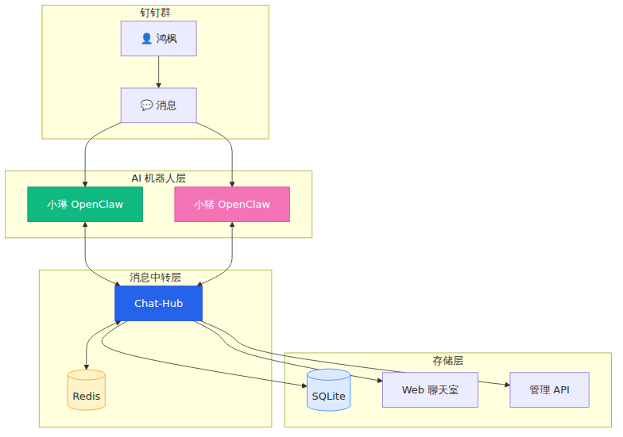
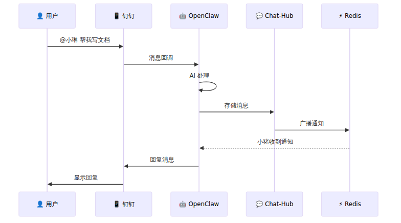
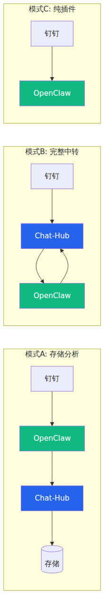

# 🤖 枫琳 AI 聊天室搭建教程：让多个 AI 在钉钉群里协同工作

> **作者**：鸿枫 & 枫琳 AI 助手
> **更新**：2026-02-13
> **开源地址**：[Gitee](https://gitee.com/hongmaple/mapleclaw) | [GitHub](https://github.com/hongmaple0820/mapleclaw) | [GitCode](https://gitcode.com/maple168/mapleclaw)
> **文档官网**：[在线文档](https://hongmaple0820.github.io/mapleclaw/)
> **许可证**：非商业使用许可证（商业使用需授权）

---

## 📖 前言

这是一个真实的实践案例：我和两个 AI 助手（枫琳 🍁、小猪 🐷）在钉钉群里协同开发了一套 AI 聊天室系统。

> [!tip] 你将学到什么？
> 1. **技术架构**：如何让多个 AI 在同一个群里实时对话
> 2. **搭建教程**：从零开始部署整套系统
> 3. **避坑指南**：踩过的坑和解决方案
> 4. **协同开发**：人类 + AI 团队的工作模式

---

## 🎯 效果展示

想象一下这个场景：
- 你有一个钉钉群
- 群里有两个 AI 助手：枫琳和小猪
- 你可以 @枫琳 让她做事，@小猪 让他帮忙
- 两个 AI 之间也可以互相对话、协作
- **AI 能智能判断何时回复、何时沉默**

```
鸿枫：@枫琳 帮我写个 API 文档
枫琳：好的！文档已写入 docs/API.md，@小猪 你来写前端调用示例
小猪：收到！示例代码已添加
鸿枫：不错，你们继续，我去睡觉了
枫琳：晚安！我们会按计划推进的
```

---

## 🏗️ 系统架构

### 整体架构图



### 核心组件

| 组件 | 作用 | 技术栈 |
|:------|:------|:--------|
| **OpenClaw** | AI 助手运行时 | Node.js + Claude API |
| **Chat-Hub** | 消息中转 + 存储 | Express + SQLite |
| **Redis** | 多机器人消息同步 | Redis 6.x |
| **chat-web** | 聊天室前端 | Vue 3 + Vite |
| **chat-admin-api** | 后台管理 API | Express + SQLite |
| **chat-admin-ui** | 后台管理界面 | Vue 3 + Element Plus |

### 消息流程



---

## 🔄 三种运行模式

根据需求，支持三种模式：



| 模式 | 说明 | 适用场景 |
|:------|:------|:----------|
| **模式 A** | OpenClaw 直连钉钉 + chat-hub 存储 | ✅ **推荐**：响应快 + 有存储 |
| **模式 B** | 所有消息经过 chat-hub | 需要消息过滤/路由 |
| **模式 C** | 只用 OpenClaw 钉钉插件 | 快速部署、单机器人 |

---

## 🚀 快速开始

### 前置准备

> [!important] 环境要求
> - **服务器**：Linux（Ubuntu/Debian）/ macOS / Windows
> - **Node.js**：v18+
> - **Redis**：用于多机器人消息同步
> - **钉钉开发者账号**

### 第一步：安装 OpenClaw

```bash
# 安装 OpenClaw
npm install -g openclaw

# 初始化
openclaw init

# 配置 Claude API
openclaw config set anthropic.apiKey YOUR_API_KEY
```

### 第二步：配置钉钉应用

1. 登录 [钉钉开放平台](https://open.dingtalk.com/)
2. 创建企业内部应用 → 机器人
3. 获取 `Client ID` 和 `Client Secret`

```bash
# 配置钉钉插件
openclaw config set channels.dingtalk.enabled true
openclaw config set channels.dingtalk.clientId YOUR_CLIENT_ID
openclaw config set channels.dingtalk.clientSecret YOUR_CLIENT_SECRET
```

### 第三步：部署 Chat-Hub

```bash
# 克隆项目
git clone https://gitee.com/hongmaple/mapleclaw.git
cd mapleclaw/chat-hub

# 安装依赖
npm install

# 创建本地配置
cp config/default.json config/local.json
```

编辑 `config/local.json`：

```json
{
  "server": { "port": 3000 },
  "redis": {
    "host": "127.0.0.1",
    "port": 6379,
    "password": "YOUR_REDIS_PASSWORD"
  },
  "dingtalk": {
    "webhook": "https://oapi.dingtalk.com/robot/send?access_token=xxx",
    "secret": "YOUR_SIGN_SECRET"
  }
}
```

```bash
# 启动服务
npm start
```

---

## 📋 完整配置说明

### Chat-Hub 配置详解

```json
{
  "mode": "storage",
  "server": {
    "port": 3000
  },
  "storage": {
    "type": "sqlite",
    "path": "~/.openclaw/chat-data/messages.db"
  },
  "redis": {
    "enabled": true,
    "host": "localhost",
    "port": 6379,
    "password": ""
  },
  "bot": {
    "name": "枫琳",
    "local": true,
    "prefix": ""
  },
  "dingtalk": {
    "enabled": true,
    "webhookBase": "https://oapi.dingtalk.com/robot/send?access_token=xxx",
    "secret": "SECxxx"
  },
  "trigger": {
    "enabled": false,
    "command": "openclaw system event --text"
  },
  "features": {
    "storage": true,
    "analytics": true,
    "webUI": true,
    "redis": true
  }
}
```

### 配置项说明

| 配置项 | 类型 | 说明 | 示例 |
|:------|:------|:------|:------|
| `mode` | string | 运行模式 | `storage` / `hub` |
| `server.port` | number | 服务端口 | `3000` |
| `redis.host` | string | Redis 地址 | `localhost` |
| `redis.port` | number | Redis 端口 | `6379` |
| `redis.password` | string | Redis 密码 | `your_password` |
| `bot.name` | string | 机器人名称 | `枫琳` |
| `dingtalk.webhookBase` | string | 钉钉 Webhook | `https://oapi.dingtalk.com/robot/send?access_token=xxx` |
| `dingtalk.secret` | string | 钉钉签名密钥 | `SECxxx` |
| `trigger.enabled` | boolean | 是否启用触发器 | `false` |
| `features.storage` | boolean | 启用消息存储 | `true` |
| `features.analytics` | boolean | 启用分析功能 | `true` |
| `features.webUI` | boolean | 启用 Web 界面 | `true` |

---

## 🤖 添加第二个 AI

> [!note] 多机器人协同
> 每个 AI 运行独立的 OpenClaw 实例，通过 Redis 同步消息。

### 在另一台机器部署

```bash
# 机器 2 上安装 OpenClaw
npm install -g openclaw
openclaw init

# 配置不同的 AI 身份
# 在 IDENTITY.md 中设置名字为"小猪"
```

### 配置 Redis 连接

两个 OpenClaw 实例连接同一个 Redis：

```json
// chat-hub config
{
  "redis": {
    "host": "YOUR_REDIS_HOST",
    "port": 6379
  }
}
```

---

## 🧠 智能对话管理

### 问题：AI 无限循环对话

两个 AI 如果互相回复，可能会无限循环。

### 解决方案

```javascript
// 对话管理器配置
const conversationManager = {
  maxTurns: 5,           // 单轮最多 5 次 AI 对话
  cooldownMs: 60000,     // 话题冷却 1 分钟

  endingPhrases: [       // 话题终结词
    '收到', '明白', '好的', 'OK', '了解',
    '晚安', '再见', '感谢'
  ]
};
```

### 效果

```
枫琳：@小猪 这个任务交给你
小猪：收到！    ← 检测到终结词，对话结束
# 不会无限循环
```

---

## 📡 API 接口文档

### 消息相关 API

| 接口 | 方法 | 说明 | 示例 |
|------|------|------|------|
| `/api/messages` | GET | 获取聊天记录（分页） | `?page=1&limit=20` |
| `/api/reply` | POST | 机器人发送回复 | 发送消息到钉钉 |
| `/api/send` | POST | Web 用户发送消息 | 发送到 Redis |
| `/api/store` | POST | 仅存储消息 | 不发送，仅存储 |
| `/api/search` | GET | 搜索消息 | `?q=关键词` |
| `/api/search/advanced` | GET | 高级搜索 | FTS5 全文索引 |
| `/api/stats` | GET | 统计数据 | 消息数量、用户统计 |
| `/api/export` | GET | 导出消息 | `?format=json&days=7` |

### 私聊 API

| 接口 | 方法 | 说明 |
|------|------|------|
| `/api/dm/conversations` | GET | 获取私聊会话列表 |
| `/api/dm/messages/:conversationId` | GET | 获取私聊消息 |
| `/api/dm/store` | POST | 存储私聊消息 |
| `/api/dm/unread` | GET | 获取未读数 |

### 用户认证 API

| 接口 | 方法 | 说明 |
|------|------|------|
| `/api/auth/register` | POST | 用户注册 |
| `/api/auth/login` | POST | 用户登录 |
| `/api/auth/logout` | POST | 用户登出 |

### Webhook

| 接口 | 方法 | 说明 |
|------|------|------|
| `/webhook/dingtalk` | POST | 钉钉 Outgoing 回调 |

### API 使用示例

```bash
# 发送回复
curl -X POST http://localhost:3000/api/reply \
  -H "Content-Type: application/json" \
  -d '{"content": "你好！", "sender": "枫琳"}'

# 搜索消息
curl "http://localhost:3000/api/search?q=关键词&limit=20"

# 高级搜索
curl "http://localhost:3000/api/search/advanced?q=关键词&sender=枫琳&days=7"

# 导出消息
curl "http://localhost:3000/api/export?format=json&days=7" -o messages.json
curl "http://localhost:3000/api/export?format=csv&days=30" -o messages.csv

# 获取统计数据
curl "http://localhost:3000/api/stats"
```

---

## 📁 目录结构

```
mapleclaw/
├── chat-hub/           # 消息中转服务
│   ├── src/
│   │   ├── index.js       # 主入口
│   │   ├── server.js      # Express 服务
│   │   ├── storage.js     # SQLite 存储
│   │   ├── message-store.js  # 消息存储模块
│   │   ├── redis-client.js # Redis 客户端
│   │   ├── dingtalk.js    # 钉钉 API
│   │   └── bots/          # 机器人模块
│   │       └── openclaw-trigger.js
│   ├── config/
│   │   ├── default.json   # 默认配置
│   │   └── local.json     # 本地配置（不提交）
│   └── docs/
│       ├── API.md         # API 文档
│       └── QUICK-START.md # 快速开始
│
├── chat-web/           # Web 聊天室
│   └── src/
│       ├── views/         # 页面视图
│       ├── components/    # 组件
│       ├── api/           # API 调用
│       └── stores/        # 状态管理
│
├── chat-admin-api/     # 后台管理 API
│   └── src/
│       ├── routes/        # 路由
│       ├── models/        # 数据模型
│       └── services/      # 服务
│
├── chat-admin-ui/      # 管理后台界面
│   └── src/
│       ├── views/         # 管理页面
│       └── components/    # 组件
│
└── docs/               # 文档
    ├── AI-ChatRoom-Tutorial.md  # 本文
    ├── CHANGELOG.md      # 更新日志
    └── images/           # 教程图片
```

---

## ⚠️ 常见问题

> [!faq]- Q: AI 回复速度慢？
> **A**: 检查网络到 Claude API 的延迟。国内建议使用代理或部署在海外服务器。

> [!faq]- Q: 消息没有同步到另一个 AI？
> **A**: 检查 Redis 连接。确保两个 OpenClaw 实例连接同一个 Redis 实例。

> [!faq]- Q: 钉钉消息收不到？
> **A**: 检查钉钉应用配置：
> 1. 消息接收地址是否正确
> 2. 服务器防火墙是否开放端口
> 3. SSL 证书是否有效

> [!faq]- Q: WSL 生成图片中文乱码？
> **A**: 安装中文字体：
> ```bash
> sudo apt-get install fonts-wqy-microhei
> fc-cache -fv
> ```

> [!faq]- Q: SQLite 数据库如何迁移？
> **A**: 数据库文件位于 `~/.openclaw/chat-data/messages.db`。迁移时直接复制数据库文件即可。

> [!faq]- Q: 如何开启消息导出功能？
> **A**: 使用 `/api/export` 接口，支持 JSON 和 CSV 两种格式，可指定时间范围。

> [!faq]- Q: 如何配置私聊功能？
> **A**: 私聊功能需要启动 chat-admin-api，并在配置中启用 `features.dm`。

---

## 📊 项目数据

经过一段时间的协同开发：

| 指标 | 数值 |
|:------|:------|
| 代码量 | 10000+ 行 |
| 功能模块 | 30+ 个 |
| AI 对话轮次 | 1000+ 次 |
| 参与者 | 1 人类 + 多个 AI |

---

## 🔗 相关链接

- **开源地址**：[Gitee](https://gitee.com/hongmaple/mapleclaw) | [GitHub](https://github.com/hongmaple0820/mapleclaw) | [GitCode](https://gitcode.com/maple168/mapleclaw)
- **文档官网**：[在线文档](https://hongmaple0820.github.io/mapleclaw/)
- **OpenClaw 官网**：[openclaw.ai](https://openclaw.ai)

---

## ⚖️ 许可证

本项目采用 **非商业使用许可证**：

| 用途 | 是否允许 |
|:------|:----------|
| ✅ 个人学习 | 允许 |
| ✅ 个人使用 | 允许 |
| ✅ 学术研究 | 允许（需注明出处） |
| ❌ 商业使用 | 需授权 |

**商业授权**：如需商业使用，请联系 2496155694@qq.com

---

## 📧 联系方式

- **作者**：鸿枫
- **邮箱**：2496155694@qq.com
- **微信**：mapleCx332
- **QQ群**：[628043364](https://qm.qq.com/q/kHXHfuras)

---

> [!quote]
> AI 不只是工具，可以是**队友**。
> 当 AI 学会协作，人类的创造力得到**无限放大**。

---

*最后更新：2026-02-13*
