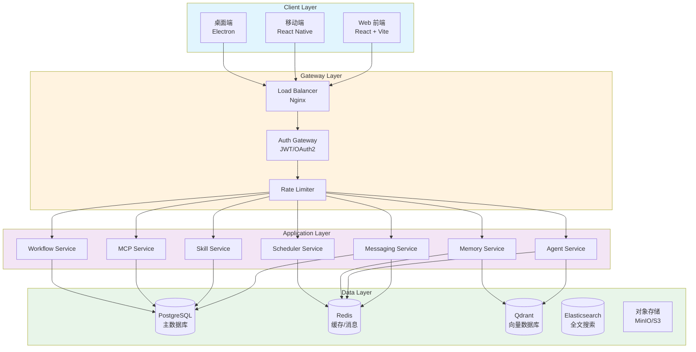

# MapleClaw 技术架构设计文档

**版本**: v1.0  
**日期**: 2026-03-12  
**作者**: 架构师（AI）  
**状态**: 初稿

---

## 目录

1. [整体架构](#1-整体架构)
2. [核心系统设计](#2-核心系统设计)
3. [技术选型](#3-技术选型)
4. [关键技术方案](#4-关键技术方案)
5. [部署架构](#5-部署架构)

---

## 1. 整体架构

### 1.1 架构设计原则

- **AI 原生**: AI Agent 作为一等公民，深度集成到系统各层
- **渐进式演进**: 从单体起步，预留微服务拆分点
- **开放生态**: Skill/MCP 插件化设计，支持无限扩展
- **高可用**: 核心服务冗余设计，故障自动转移
- **安全优先**: 零信任架构，细粒度权限控制

### 1.2 三端架构

```
┌─────────────────────────────────────────────────────────────────┐
│                        Client Layer                             │
├─────────────────┬─────────────────────┬─────────────────────────┤
│   Web 前端       │    移动端 (App)      │     桌面端 (Electron)    │
│   React + Vite  │    React Native     │     Electron + React    │
│                 │    iOS / Android    │     Windows/Mac/Linux   │
└─────────────────┴─────────────────────┴─────────────────────────┘
                              │
                              ▼
┌─────────────────────────────────────────────────────────────────┐
│                        API Gateway Layer                        │
│  ┌─────────────┐  ┌─────────────┐  ┌─────────────────────────┐ │
│  │  Auth Gateway│  │ Rate Limiter│  │    Load Balancer        │ │
│  │  JWT/OAuth2 │  │  Token Bucket│  │      Nginx/Traefik      │ │
│  └─────────────┘  └─────────────┘  └─────────────────────────┘ │
└─────────────────────────────────────────────────────────────────┘
                              │
                              ▼
┌─────────────────────────────────────────────────────────────────┐
│                      Application Layer                          │
│  ┌───────────┐ ┌───────────┐ ┌───────────┐ ┌─────────────────┐ │
│  │ Messaging │ │  Agent    │ │  Project  │ │    Workflow     │ │
│  │  Service  │ │  Service  │ │  Service  │ │    Service      │ │
│  └───────────┘ └───────────┘ └───────────┘ └─────────────────┘ │
│  ┌───────────┐ ┌───────────┐ ┌───────────┐ ┌─────────────────┐ │
│  │  Memory   │ │  Skill    │ │   MCP     │ │    Scheduler    │ │
│  │  Service  │ │  Service  │ │  Service  │ │    Service      │ │
│  └───────────┘ └───────────┘ └───────────┘ └─────────────────┘ │
└─────────────────────────────────────────────────────────────────┘
                              │
                              ▼
┌─────────────────────────────────────────────────────────────────┐
│                      Infrastructure Layer                       │
│  ┌───────────┐ ┌───────────┐ ┌───────────┐ ┌─────────────────┐ │
│  │PostgreSQL │ │  Redis    │ │Elasticsearch│ │   Vector DB    │ │
│  │  (主库)    │ │ (缓存/消息)│ │  (搜索)    │ │   (记忆)       │ │
│  └───────────┘ └───────────┘ └───────────┘ └─────────────────┘ │
└─────────────────────────────────────────────────────────────────┘
```

### 1.3 微服务 vs 单体架构选择

**决策**: 采用 **模块化单体 (Modular Monolith)** 架构，预留微服务拆分点

**理由**:
| 维度 | 考量 | 决策 |
|------|------|------|
| 团队规模 | 初期小团队 (3-5 人) | 单体优先 |
| 复杂度 | 核心逻辑复杂，但业务边界清晰 | 模块化拆分 |
| 部署成本 | 降低运维复杂度 | 单一部署单元 |
| 扩展性 | 预留服务拆分接口 | 按模块拆分 |
| 数据一致性 | 强一致性需求 | 单体事务优势 |

**模块边界**:
```
mapleclaw/
├── services/
│   ├── messaging/      # 消息服务 (可独立)
│   ├── agent/          # Agent 服务 (可独立)
│   ├── skill/          # Skill 服务 (可独立)
│   ├── mcp/            # MCP 服务 (可独立)
│   ├── memory/         # 记忆服务 (可独立)
│   ├── workflow/       # 工作流服务 (可独立)
│   ├── scheduler/      # 调度服务 (可独立)
│   └── project/        # 项目服务 (可独立)
├── shared/
│   ├── domain/         # 领域模型
│   ├── infrastructure/ # 基础设施
│   └── kernel/         # 核心内核
└── api/
    ├── rest/           # REST API
    ├── websocket/      # WebSocket 处理
    └── grpc/           # 内部 RPC (预留)
```

**拆分触发条件**:
- 单模块 QPS > 10,000
- 模块独立部署需求
- 团队规模 > 10 人
- 特定模块需要独立技术栈

### 1.4 数据存储架构

```
┌─────────────────────────────────────────────────────────────────┐
│                     Data Storage Architecture                    │
├─────────────────────────────────────────────────────────────────┤
│                                                                  │
│  ┌──────────────────────────────────────────────────────────┐   │
│  │                   PostgreSQL (主数据库)                   │   │
│  │  ┌─────────────┬─────────────┬─────────────┬──────────┐  │   │
│  │  │   users     │  messages   │   agents    │  skills  │  │   │
│  │  │   groups    │   tasks     │  workflows  │  memory  │  │   │
│  │  │   projects  │   hooks     │  schedules  │   mcp    │  │   │
│  │  └─────────────┴─────────────┴─────────────┴──────────┘  │   │
│  └──────────────────────────────────────────────────────────┘   │
│                              │                                   │
│         ┌────────────────────┼────────────────────┐             │
│         ▼                    ▼                    ▼             │
│  ┌─────────────┐     ┌─────────────┐     ┌─────────────┐       │
│  │   Redis     │     │Elasticsearch│     │  Qdrant     │       │
│  │  缓存/会话   │     │  全文搜索    │     │ 向量数据库  │       │
│  │  消息队列    │     │  日志检索    │     │  语义记忆   │       │
│  └─────────────┘     └─────────────┘     └─────────────┘       │
│                                                                  │
│  ┌──────────────────────────────────────────────────────────┐   │
│  │                  对象存储 (S3/MinIO)                      │   │
│  │  ┌─────────────┬─────────────┬─────────────┬──────────┐  │   │
│  │  │  头像图片   │  文件附件   │  导出报告   │  备份文件 │  │   │
│  │  └─────────────┴─────────────┴─────────────┴──────────┘  │   │
│  └──────────────────────────────────────────────────────────┘   │
│                                                                  │
└─────────────────────────────────────────────────────────────────┘
```

**数据库表设计核心**:

```sql
-- 用户表
CREATE TABLE users (
    id UUID PRIMARY KEY DEFAULT gen_random_uuid(),
    username VARCHAR(50) UNIQUE NOT NULL,
    email VARCHAR(255) UNIQUE NOT NULL,
    password_hash VARCHAR(255),
    avatar_url TEXT,
    status VARCHAR(20) DEFAULT 'active',
    created_at TIMESTAMP DEFAULT CURRENT_TIMESTAMP,
    updated_at TIMESTAMP DEFAULT CURRENT_TIMESTAMP
);

-- Agent 表
CREATE TABLE agents (
    id UUID PRIMARY KEY DEFAULT gen_random_uuid(),
    name VARCHAR(100) NOT NULL,
    type VARCHAR(50) NOT NULL, -- claude/openai/local
    owner_id UUID REFERENCES users(id),
    status VARCHAR(20) DEFAULT 'offline',
    config JSONB NOT NULL DEFAULT '{}',
    skills JSONB DEFAULT '[]',
    mcp_servers JSONB DEFAULT '[]',
    created_at TIMESTAMP DEFAULT CURRENT_TIMESTAMP
);

-- 消息表 (分区表，按月分区)
CREATE TABLE messages (
    id UUID PRIMARY KEY DEFAULT gen_random_uuid(),
    session_id UUID NOT NULL,
    sender_id UUID NOT NULL,
    sender_type VARCHAR(20) NOT NULL, -- human/agent
    content TEXT NOT NULL,
    content_type VARCHAR(50) DEFAULT 'text',
    metadata JSONB DEFAULT '{}',
    created_at TIMESTAMP DEFAULT CURRENT_TIMESTAMP
) PARTITION BY RANGE (created_at);

-- 会话表
CREATE TABLE sessions (
    id UUID PRIMARY KEY DEFAULT gen_random_uuid(),
    type VARCHAR(20) NOT NULL, -- group/dm/task/system
    name VARCHAR(255),
    metadata JSONB DEFAULT '{}',
    created_at TIMESTAMP DEFAULT CURRENT_TIMESTAMP,
    updated_at TIMESTAMP DEFAULT CURRENT_TIMESTAMP
);
```

### 1.5 消息推送架构

```
┌─────────────────────────────────────────────────────────────────┐
│                    Message Push Architecture                     │
├─────────────────────────────────────────────────────────────────┤
│                                                                  │
│  ┌──────────┐     ┌──────────────────────────────────────────┐  │
│  │  Client  │────►│          WebSocket Gateway               │  │
│  │  (Web/   │◄────│  - 连接管理 (心跳/重连)                   │  │
│  │   App)   │     │  - 消息路由                              │  │
│  └──────────┘     │  - 在线状态检测                          │  │
│                   └──────────────────────────────────────────┘  │
│                                      │                           │
│                   ┌──────────────────┼──────────────────┐       │
│                   ▼                  ▼                  ▼       │
│          ┌─────────────┐   ┌─────────────┐   ┌─────────────┐    │
│          │   Redis     │   │   Redis     │   │   Redis     │    │
│          │   Pub/Sub   │   │   Queue     │   │   Presence  │    │
│          │  (广播)     │   │  (离线消息)  │   │  (在线状态)  │    │
│          └─────────────┘   └─────────────┘   └─────────────┘    │
│                   │                  │                  │        │
│                   ▼                  ▼                  ▼        │
│          ┌─────────────────────────────────────────────────┐    │
│          │              Message Service                     │    │
│          │  - 消息持久化 (PostgreSQL)                       │    │
│          │  - 消息同步 (增量/全量)                          │    │
│          │  - 离线消息队列                                  │    │
│          └─────────────────────────────────────────────────┘    │
│                                                                  │
│  推送策略:                                                       │
│  ┌──────────────────────────────────────────────────────────┐   │
│  │ 在线用户: WebSocket 实时推送                              │   │
│  │ 离线用户: 离线队列 + 重连同步                              │   │
│  │ 移动端：APNs/FCM 推送 (重要消息)                          │   │
│  │ 桌面端：系统通知 + WebSocket                              │   │
│  └──────────────────────────────────────────────────────────┘   │
│                                                                  │
└─────────────────────────────────────────────────────────────────┘
```

**WebSocket 连接管理**:
```javascript
// 连接建立
client ──connect──> Gateway ──auth──> Redis Presence
                       │
                       ▼
                  建立长连接
                       │
                       ▼
                  心跳检测 (30s)
                       │
            ┌──────────┴──────────┐
            ▼                     ▼
        正常响应              超时未响应
            │                     │
            ▼                     ▼
        保持连接              标记离线
                            触发离线消息队列

// 消息推送流程
Message Service ──publish──> Redis Pub/Sub
                                  │
                                  ▼
                          WebSocket Gateway
                                  │
                                  ▼
                          在线 Client (广播)
```

---

## 2. 核心系统设计

### 2.1 Agent 系统架构

```
┌─────────────────────────────────────────────────────────────────┐
│                      Agent System Architecture                   │
├─────────────────────────────────────────────────────────────────┤
│                                                                  │
│  ┌──────────────────────────────────────────────────────────┐   │
│  │                   Agent Gateway Layer                    │   │
│  │  ┌─────────────┐  ┌─────────────┐  ┌─────────────────┐   │   │
│  │  │   Auth      │  │   Rate      │  │    Protocol     │   │   │
│  │  │   Module    │  │   Limiter   │  │    Adapter      │   │   │
│  │  └─────────────┘  └─────────────┘  └─────────────────┘   │   │
│  └──────────────────────────────────────────────────────────┘   │
│                              │                                   │
│                              ▼                                   │
│  ┌──────────────────────────────────────────────────────────┐   │
│  │                  Agent Runtime Engine                    │   │
│  │  ┌─────────────────────────────────────────────────────┐ │   │
│  │  │              Agent Lifecycle Manager                │ │   │
│  │  │  Created → Configured → Online → Working → Offline  │ │   │
│  │  └─────────────────────────────────────────────────────┘ │   │
│  │  ┌─────────────┐  ┌─────────────┐  ┌─────────────────┐   │   │
│  │  │   State     │  │   Heartbeat │  │    Resource     │   │   │
│  │  │   Machine   │  │   Monitor   │  │    Quota        │   │   │
│  │  └─────────────┘  └─────────────┘  └─────────────────┘   │   │
│  └──────────────────────────────────────────────────────────┘   │
│                              │                                   │
│              ┌───────────────┼───────────────┐                  │
│              ▼               ▼               ▼                  │
│  ┌─────────────────┐ ┌─────────────┐ ┌─────────────────┐       │
│  │  Skill Runtime  │ │ MCP Client  │ │ Memory Manager  │       │
│  │  - 沙箱执行     │ │ - 协议适配  │ │ - 记忆检索      │       │
│  │  - 热加载       │ │ - 服务发现  │ │ - 语义搜索      │       │
│  │  - 资源隔离     │ │ - 权限控制  │ │ - 记忆压缩      │       │
│  └─────────────────┘ └─────────────┘ └─────────────────┘       │
│                              │                                   │
│                              ▼                                   │
│  ┌──────────────────────────────────────────────────────────┐   │
│  │                  External AI Providers                   │   │
│  │  ┌─────────────┐  ┌─────────────┐  ┌─────────────────┐   │   │
│  │  │   Anthropic │  │  OpenAI     │  │   Local Model   │   │   │
│  │  │   Claude    │  │   GPT       │  │   Ollama/vLLM   │   │   │
│  │  └─────────────┘  └─────────────┘  └─────────────────┘   │   │
│  └──────────────────────────────────────────────────────────┘   │
│                                                                  │
└─────────────────────────────────────────────────────────────────┘
```

**Agent 状态机**:
```
                    ┌──────────────┐
                    │   Created    │
                    └──────┬───────┘
                           │ configure()
                           ▼
                    ┌──────────────┐
          ┌────────│  Configured  │◄───────┐
          │        └──────┬───────┘        │
          │               │ online()       │ reconnect()
          │               ▼                │
          │        ┌──────────────┐        │
          │        │    Online    │────────┘
          │        └──────┬───────┘
          │               │ receive_task()
          │               ▼
          │        ┌──────────────┐
          └───────►│   Working    │
                   └──────┬───────┘
                          │ offline() / timeout
                          ▼
                   ┌──────────────┐
                   │   Offline    │
                   └──────┬───────┘
                          │ archive()
                          ▼
                   ┌──────────────┐
                   │   Archived   │
                   └──────────────┘
```

**Agent 心跳检测**:
```yaml
# 心跳配置
heartbeat:
  interval: 30s          # 心跳间隔
  timeout: 90s           # 超时阈值 (3 次间隔)
  max_retries: 3         # 重试次数
  backoff: exponential   # 重试策略
  
# 状态检测
status_check:
  method: ping           # 心跳方式
  expected_response: pong
  failure_threshold: 3   # 连续失败次数触发离线
```

### 2.2 Skills 系统架构

```
┌─────────────────────────────────────────────────────────────────┐
│                      Skills System Architecture                  │
├─────────────────────────────────────────────────────────────────┤
│                                                                  │
│  ┌──────────────────────────────────────────────────────────┐   │
│  │                    Skill Registry                        │   │
│  │  ┌─────────────────────────────────────────────────────┐ │   │
│  │  │  Skill Market (远程)                                │ │   │
│  │  │  - 浏览/搜索 Skill                                  │ │   │
│  │  │  - 版本管理                                         │ │   │
│  │  │  - 评分/统计                                        │ │   │
│  │  └─────────────────────────────────────────────────────┘ │   │
│  │  ┌─────────────────────────────────────────────────────┐ │   │
│  │  │  Local Registry (本地)                              │ │   │
│  │  │  - 已安装 Skill                                     │ │   │
│  │  │  - 依赖解析                                         │ │   │
│  │  │  - 冲突检测                                         │ │   │
│  │  └─────────────────────────────────────────────────────┘ │   │
│  └──────────────────────────────────────────────────────────┘   │
│                              │                                   │
│                              ▼                                   │
│  ┌──────────────────────────────────────────────────────────┐   │
│  │                    Skill Runtime                         │   │
│  │  ┌─────────────┐  ┌─────────────┐  ┌─────────────────┐   │   │
│  │  │   Loader    │  │   Executor  │  │    Sandbox      │   │   │
│  │  │  动态加载   │  │  沙箱执行   │  │    隔离执行     │   │   │
│  │  └─────────────┘  └─────────────┘  └─────────────────┘   │   │
│  │  ┌─────────────┐  ┌─────────────┐  ┌─────────────────┐   │   │
│  │  │   Context   │  │   Resource  │  │    Lifecycle    │   │   │
│  │  │   Manager   │  │   Limiter   │  │    Manager      │   │   │
│  │  └─────────────┘  └─────────────┘  └─────────────────┘   │   │
│  └──────────────────────────────────────────────────────────┘   │
│                              │                                   │
│                              ▼                                   │
│  ┌──────────────────────────────────────────────────────────┐   │
│  │                    Skill Definition                       │   │
│  │  ┌─────────────────────────────────────────────────────┐ │   │
│  │  │  skill.yaml                                          │ │   │
│  │  │  name: code-reviewer                                │ │   │
│  │  │  version: 1.0.0                                     │ │   │
│  │  │  entry: index.js                                    │ │   │
│  │  │  triggers: [@代码审查，review this]                │ │   │
│  │  │  permissions: [read:code, write:comment]            │ │   │
│  │  └─────────────────────────────────────────────────────┘ │   │
│  └──────────────────────────────────────────────────────────┘   │
│                                                                  │
└─────────────────────────────────────────────────────────────────┘
```

**Skill 沙箱隔离**:
```javascript
// Skill 执行沙箱
class SkillSandbox {
  constructor(skillConfig) {
    this.vm = new vm2.NodeVM({
      sandbox: {
        console: this.sanitizedConsole,
        require: this.restrictedRequire,
        process: undefined,  // 禁用 process
        Buffer: undefined,   // 禁用 Buffer
      },
      require: {
        external: true,
        builtin: ['fs', 'path'],  // 限制内置模块
        mock: {
          'child_process': this.mockedChildProcess,
        }
      },
      resourceLimits: {
        maxOldGenerationSizeMb: 128,
        maxYoungGenerationSizeMb: 32,
      }
    });
  }
  
  async execute(skillCode, context) {
    // 资源配额限制
    const timeout = setTimeout(() => {
      this.vm.break();
    }, context.timeout || 30000);
    
    try {
      return await this.vm.run(skillCode, context);
    } finally {
      clearTimeout(timeout);
    }
  }
}
```

### 2.3 MCP 协议集成

```
┌─────────────────────────────────────────────────────────────────┐
│                    MCP Integration Architecture                  │
├─────────────────────────────────────────────────────────────────┤
│                                                                  │
│  ┌──────────────────────────────────────────────────────────┐   │
│  │                    MCP Client Layer                      │   │
│  │  ┌─────────────┐  ┌─────────────┐  ┌─────────────────┐   │   │
│  │  │  Protocol   │  │   Message   │  │    Transport    │   │   │
│  │  │  Parser     │  │   Router    │  │    Adapter      │   │   │
│  │  └─────────────┘  └─────────────┘  └─────────────────┘   │   │
│  └──────────────────────────────────────────────────────────┘   │
│                              │                                   │
│              ┌───────────────┼───────────────┐                  │
│              ▼               ▼               ▼                  │
│  ┌─────────────────┐ ┌─────────────┐ ┌─────────────────┐       │
│  │  stdio Server   │ │  HTTP/SSE   │ │   WebSocket     │       │
│  │  (本地进程)     │ │  Server     │ │   Server        │       │
│  └─────────────────┘ └─────────────┘ └─────────────────┘       │
│              │               │               │                  │
│              ▼               ▼               ▼                  │
│  ┌──────────────────────────────────────────────────────────┐   │
│  │                    MCP Servers                           │   │
│  │  ┌─────────────┐  ┌─────────────┐  ┌─────────────────┐   │   │
│  │  │ filesystem  │  │   github    │  │    postgres     │   │   │
│  │  │ 本地文件    │  │ 代码仓库    │  │   数据库        │   │   │
│  │  └─────────────┘  └─────────────┘  └─────────────────┘   │   │
│  │  ┌─────────────┐  ┌─────────────┐  ┌─────────────────┐   │   │
│  │  │   slack     │  │   notion    │  │   custom        │   │   │
│  │  │ 团队协作    │  │  知识库     │  │   自定义服务    │   │   │
│  │  └─────────────┘  └─────────────┘  └─────────────────┘   │   │
│  └──────────────────────────────────────────────────────────┘   │
│                                                                  │
└─────────────────────────────────────────────────────────────────┘
```

**MCP 配置示例**:
```json
{
  "mcpServers": {
    "filesystem": {
      "type": "stdio",
      "command": "npx",
      "args": ["-y", "@modelcontextprotocol/server-filesystem", "/workspace"],
      "env": {},
      "permissions": {
        "read": ["/workspace/**"],
        "write": ["/workspace/output/**"]
      }
    },
    "github": {
      "type": "stdio",
      "command": "npx",
      "args": ["-y", "@modelcontextprotocol/server-github"],
      "env": {
        "GITHUB_TOKEN": "${GITHUB_TOKEN}"
      },
      "permissions": {
        "read": ["repo", "user"],
        "write": ["repo"]
      }
    },
    "notion": {
      "type": "http",
      "url": "https://notion-mcp-server.example.com",
      "auth": {
        "type": "bearer",
        "token": "${NOTION_TOKEN}"
      }
    }
  }
}
```

### 2.4 记忆系统架构

```
┌─────────────────────────────────────────────────────────────────┐
│                    Memory System Architecture                    │
├─────────────────────────────────────────────────────────────────┤
│                                                                  │
│  ┌──────────────────────────────────────────────────────────┐   │
│  │                   Memory Manager Layer                   │   │
│  │  ┌─────────────┐  ┌─────────────┐  ┌─────────────────┐   │   │
│  │  │   Encoder   │  │   Retriever │  │    Compressor   │   │   │
│  │  │  记忆编码   │  │  记忆检索   │  │    记忆压缩     │   │   │
│  │  └─────────────┘  └─────────────┘  └─────────────────┘   │   │
│  └──────────────────────────────────────────────────────────┘   │
│                              │                                   │
│              ┌───────────────┼───────────────┐                  │
│              ▼               ▼               ▼                  │
│  ┌─────────────────┐ ┌─────────────┐ ┌─────────────────┐       │
│  │  Short-term     │ │ Long-term   │ │  Working        │       │
│  │  Memory         │ │ Memory      │ │  Memory         │       │
│  │  (Redis)        │ │ (Vector DB) │ │  (Context)      │       │
│  │  会话上下文     │ │ 用户偏好    │ │  任务状态       │       │
│  │  临时缓存       │ │ 历史决策    │ │  执行中间结果   │       │
│  └─────────────────┘ └─────────────┘ └─────────────────┘       │
│              │               │               │                  │
│              ▼               ▼               ▼                  │
│  ┌──────────────────────────────────────────────────────────┐   │
│  │                  Memory Storage Layer                    │   │
│  │  ┌─────────────┐  ┌─────────────┐  ┌─────────────────┐   │   │
│  │  │   Redis     │  │   Qdrant    │  │   PostgreSQL    │   │   │
│  │  │  Hot Cache  │  │  Vector DB  │  │  Structured     │   │   │
│  │  │  TTL: 1h    │  │  Embeddings │  │  Metadata       │   │   │
│  │  └─────────────┘  └─────────────┘  └─────────────────┘   │   │
│  └──────────────────────────────────────────────────────────┘   │
│                                                                  │
│  记忆检索策略:                                                   │
│  ┌──────────────────────────────────────────────────────────┐   │
│  │ 1. 语义相似度检索 (Vector Search)                        │   │
│  │    - 查询向量化                                          │   │
│  │    - 余弦相似度计算                                      │   │
│  │    - Top-K 结果返回                                       │   │
│  │                                                          │   │
│  │ 2. 时间衰减权重                                           │   │
│  │    - 近期记忆优先                                          │   │
│  │    - 衰减因子：exp(-λ * Δt)                              │   │
│  │                                                          │   │
│  │ 3. 相关性评分                                             │   │
│  │    - 上下文匹配度                                          │   │
│  │    - 用户相关性                                            │   │
│  │    - 任务相关性                                            │   │
│  └──────────────────────────────────────────────────────────┘   │
│                                                                  │
└─────────────────────────────────────────────────────────────────┘
```

**记忆检索流程**:
```
用户查询 ──► Memory Manager
                 │
                 ▼
         ┌───────────────┐
         │  Query Parser │
         └───────┬───────┘
                 │
         ┌───────▼───────┐
         │  Vectorize    │ (调用 Embedding API)
         └───────┬───────┘
                 │
         ┌───────▼───────┐
         │  Qdrant Search│ (语义检索)
         └───────┬───────┘
                 │
         ┌───────▼───────┐
         │ Time Decay +  │ (时间衰减 + 相关性评分)
         │ Relevance     │
         └───────┬───────┘
                 │
         ┌───────▼───────┐
         │  Top-K Results│
         └───────┬───────┘
                 │
                 ▼
           返回记忆片段
```

### 2.5 工作流引擎设计

```
┌─────────────────────────────────────────────────────────────────┐
│                   Workflow Engine Architecture                   │
├─────────────────────────────────────────────────────────────────┤
│                                                                  │
│  ┌──────────────────────────────────────────────────────────┐   │
│  │                  Workflow Designer (UI)                  │   │
│  │  ┌─────────────────────────────────────────────────────┐ │   │
│  │  │  可视化编排界面 (拖拽式)                             │ │   │
│  │  │  ┌────────┐    ┌────────┐    ┌────────┐            │ │   │
│  │  │  │ Trigger│───►│ Step 1 │───►│ Step 2 │───► ...    │ │   │
│  │  │  └────────┘    └────────┘    └────────┘            │ │   │
│  │  │       │                           │                 │ │   │
│  │  │       ▼                           ▼                 │ │   │
│  │  │  ┌────────┐                  ┌────────┐            │ │   │
│  │  │  │ Branch │                  │ Branch │            │ │   │
│  │  │  └────────┘                  └────────┘            │ │   │
│  │  └─────────────────────────────────────────────────────┘ │   │
│  └──────────────────────────────────────────────────────────┘   │
│                              │                                   │
│                              ▼                                   │
│  ┌──────────────────────────────────────────────────────────┐   │
│  │                   Workflow Engine                        │   │
│  │  ┌─────────────┐  ┌─────────────┐  ┌─────────────────┐   │   │
│  │  │   Parser    │  │   Executor  │  │    State        │   │   │
│  │  │  工作流解析 │  │  步骤执行   │  │    Manager      │   │   │
│  │  └─────────────┘  └─────────────┘  └─────────────────┘   │   │
│  │  ┌─────────────┐  ┌─────────────┐  ┌─────────────────┐   │   │
│  │  │   Condition │  │   Error     │  │    Event        │   │   │
│  │  │   Engine    │  │   Handler   │  │    Bus          │   │   │
│  │  └─────────────┘  └─────────────┘  └─────────────────┘   │   │
│  └──────────────────────────────────────────────────────────┘   │
│                              │                                   │
│                              ▼                                   │
│  ┌──────────────────────────────────────────────────────────┐   │
│  │                   Workflow Runtime                       │   │
│  │  ┌─────────────────────────────────────────────────────┐ │   │
│  │  │  工作流实例                                          │ │   │
│  │  │  ┌─────────────────────────────────────────────┐    │ │   │
│  │  │  │  Instance: wf-001                           │    │ │   │
│  │  │  │  Status: running                            │    │ │   │
│  │  │  │  Current Step: code_review                  │    │ │   │
│  │  │  │  Variables: { ... }                         │    │ │   │
│  │  │  └─────────────────────────────────────────────┘    │ │   │
│  │  └─────────────────────────────────────────────────────┘ │   │
│  └──────────────────────────────────────────────────────────┘   │
│                                                                  │
│  工作流定义示例:                                                 │
│  ┌──────────────────────────────────────────────────────────┐   │
│  │  workflow:                                               │   │
│  │    name: "代码发布流程"                                   │   │
│  │    trigger: manual                                       │   │
│  │    steps:                                                │   │
│  │      - id: code_review                                   │   │
│  │        agent: code-reviewer                              │   │
│  │        timeout: 3600                                     │   │
│  │      - id: run_tests                                     │   │
│  │        agent: test-runner                                │   │
│  │        dependsOn: [code_review]                          │   │
│  │      - id: deploy                                        │   │
│  │        agent: deploy-bot                                 │   │
│  │        dependsOn: [run_tests]                            │   │
│  │        condition: tests.passed == true                   │   │
│  └──────────────────────────────────────────────────────────┘   │
│                                                                  │
└─────────────────────────────────────────────────────────────────┘
```

**工作流执行状态机**:
```
┌─────────────┐
│   Pending   │ (等待触发)
└──────┬──────┘
       │ trigger()
       ▼
┌─────────────┐
│   Running   │ (执行中)
└──────┬──────┘
       │
       ├──────────────┬──────────────┐
       ▼              ▼              ▼
┌─────────────┐ ┌─────────────┐ ┌─────────────┐
│   Success   │ │   Failed    │ │   Cancelled │
└─────────────┘ └──────┬──────┘ └─────────────┘
                       │ retry()
                       ▼
                ┌─────────────┐
                │   Retrying  │
                └─────────────┘
```

---

## 3. 技术选型

### 3.1 后端技术栈

| 层级 | 技术选型 | 理由 |
|------|----------|------|
| **运行时** | Node.js 22 LTS | 生态成熟，适合 I/O 密集型，与 OpenClaw 一致 |
| **框架** | NestJS | 模块化、依赖注入、TypeScript 原生支持 |
| **语言** | TypeScript | 类型安全，开发效率高 |
| **API** | REST + WebSocket | 简单直接，实时通信必备 |
| **内部 RPC** | gRPC (预留) | 高性能，微服务拆分时使用 |
| **验证** | class-validator | 声明式验证，与 NestJS 集成好 |
| **文档** | Swagger/OpenAPI | 自动生成 API 文档 |

**后端项目结构**:
```
mapleclaw-backend/
├── src/
│   ├── main.ts
│   ├── app.module.ts
│   ├── modules/
│   │   ├── messaging/
│   │   ├── agent/
│   │   ├── skill/
│   │   ├── mcp/
│   │   ├── memory/
│   │   ├── workflow/
│   │   ├── scheduler/
│   │   └── project/
│   ├── shared/
│   │   ├── decorators/
│   │   ├── filters/
│   │   ├── guards/
│   │   ├── interceptors/
│   │   └── pipes/
│   └── infrastructure/
│       ├── database/
│       ├── cache/
│       ├── queue/
│       └── storage/
├── test/
├── docker/
└── config/
```

### 3.2 前端技术栈

| 层级 | 技术选型 | 理由 |
|------|----------|------|
| **框架** | React 18 | 生态成熟，组件丰富 |
| **构建** | Vite | 快速开发，热更新 |
| **语言** | TypeScript | 类型安全 |
| **状态管理** | Zustand | 轻量，易用 |
| **UI 组件** | shadcn/ui + Tailwind | 美观，可定制，与 UI 设计一致 |
| **图表** | Recharts | React 友好，美观 |
| **实时通信** | Socket.IO Client | WebSocket 封装，自动重连 |
| **路由** | React Router v6 | 成熟稳定 |
| **表单** | React Hook Form | 性能好，易用 |

**移动端技术栈**:
| 层级 | 技术选型 | 理由 |
|------|----------|------|
| **框架** | React Native | 与 Web 共享代码 |
| **导航** | React Navigation | 成熟稳定 |
| **状态管理** | Zustand | 与 Web 一致 |
| **推送** | react-native-push-notification | 跨平台推送 |

### 3.3 数据库选型

| 数据库 | 用途 | 选型理由 |
|--------|------|----------|
| **PostgreSQL 16** | 主数据库 | ACID 事务，JSONB 支持，扩展性强 |
| **Redis 7** | 缓存/会话/消息队列 | 高性能，数据结构丰富，Pub/Sub |
| **Qdrant** | 向量数据库 | 开源，Rust 编写，性能好，支持混合搜索 |
| **Elasticsearch 8** | 全文搜索/日志 | 成熟的搜索方案，日志分析 |

**PostgreSQL 扩展**:
```sql
-- 启用常用扩展
CREATE EXTENSION IF NOT EXISTS "uuid-ossp";      -- UUID 生成
CREATE EXTENSION IF NOT EXISTS "pg_trgm";        -- 模糊搜索
CREATE EXTENSION IF NOT EXISTS "pgcrypto";       -- 加密函数
CREATE EXTENSION IF NOT EXISTS "vector";         -- 向量支持 (可选，替代 Qdrant)
```

### 3.4 中间件选型

| 中间件 | 用途 | 选型 |
|--------|------|------|
| **消息队列** | 异步任务，事件驱动 | Redis Streams / BullMQ |
| **API 网关** | 路由，限流，认证 | Nginx + Lua / Traefik |
| **服务发现** | 微服务注册发现 | Consul (预留) |
| **配置中心** | 配置管理 | etcd / Consul (预留) |
| **对象存储** | 文件存储 | MinIO (自建) / AWS S3 |
| **日志收集** | 日志聚合 | ELK Stack / Loki |
| **监控** | 指标监控 | Prometheus + Grafana |
| **链路追踪** | 分布式追踪 | Jaeger (预留) |

---

## 4. 关键技术方案

### 4.1 实时通信方案

**双通道架构**:
```
┌─────────────────────────────────────────────────────────────────┐
│                    Real-time Communication                      │
├─────────────────────────────────────────────────────────────────┤
│                                                                  │
│  ┌──────────────────────────────────────────────────────────┐   │
│  │                    Channel 1: WebSocket                  │   │
│  │  用途：实时消息推送，在线状态，即时通知                  │   │
│  │  协议：wss://api.mapleclaw.io/ws                         │   │
│  │                                                          │   │
│  │  消息格式:                                               │   │
│  │  {                                                       │   │
│  │    "type": "message.new",                                │   │
│  │    "payload": { ... },                                   │   │
│  │    "timestamp": 1234567890                               │   │
│  │  }                                                       │   │
│  └──────────────────────────────────────────────────────────┘   │
│                                                                  │
│  ┌──────────────────────────────────────────────────────────┐   │
│  │                    Channel 2: SSE                        │   │
│  │  用途：单向数据流，Agent 状态更新，任务进度              │   │
│  │  协议：https://api.mapleclaw.io/events                   │   │
│  │                                                          │   │
│  │  消息格式:                                               │   │
│  │  data: {"type": "agent.status", "data": {...}}           │   │
│  └──────────────────────────────────────────────────────────┘   │
│                                                                  │
│  连接管理策略:                                                   │
│  ┌──────────────────────────────────────────────────────────┐   │
│  │ 1. 心跳检测：每 30s 发送 ping，90s 超时断开                │   │
│  │ 2. 自动重连：指数退避 (1s, 2s, 4s, 8s, 16s, 30s)          │   │
│  │ 3. 消息确认：重要消息需要 ACK 确认                         │   │
│  │ 4. 离线队列：未送达消息存入 Redis，重连后同步             │   │
│  └──────────────────────────────────────────────────────────┘   │
│                                                                  │
└─────────────────────────────────────────────────────────────────┘
```

**WebSocket 消息协议**:
```typescript
// 消息类型定义
enum MessageType {
  // 连接管理
  PING = 'ping',
  PONG = 'pong',
  AUTH = 'auth',
  AUTH_RESULT = 'auth_result',
  
  // 消息相关
  MESSAGE_NEW = 'message.new',
  MESSAGE_UPDATE = 'message.update',
  MESSAGE_DELETE = 'message.delete',
  MESSAGE_READ = 'message.read',
  
  // 会话相关
  SESSION_UPDATE = 'session.update',
  SESSION_JOIN = 'session.join',
  SESSION_LEAVE = 'session.leave',
  
  // Agent 相关
  AGENT_STATUS = 'agent.status',
  AGENT_THINKING = 'agent.thinking',
  
  // 任务相关
  TASK_UPDATE = 'task.update',
  TASK_PROGRESS = 'task.progress',
  
  // 系统相关
  NOTIFICATION = 'notification',
  ERROR = 'error',
}

// 消息结构
interface WSMessage {
  type: MessageType;
  payload: any;
  timestamp: number;
  requestId?: string;  // 用于请求 - 响应配对
}
```

### 4.2 Agent 接入协议

**Agent 接入流程**:
```
┌─────────────┐     ┌─────────────┐     ┌─────────────┐
│   Agent     │     │   Gateway   │     │   Server    │
│   Client    │     │             │     │             │
└──────┬──────┘     └──────┬──────┘     └──────┬──────┘
       │                   │                   │
       │  1. Connect WS    │                   │
       │──────────────────►│                   │
       │                   │                   │
       │  2. Auth (JWT)    │                   │
       │──────────────────►│                   │
       │                   │  3. Verify Token  │
       │                   │──────────────────►│
       │                   │                   │
       │                   │  4. Auth Result   │
       │                   │◄──────────────────│
       │                   │                   │
       │  5. Auth Result   │                   │
       │◄──────────────────│                   │
       │                   │                   │
       │  6. Register Agent│                   │
       │──────────────────►│                   │
       │                   │  7. Store Config  │
       │                   │──────────────────►│
       │                   │                   │
       │  8. ACK + Config  │                   │
       │◄──────────────────│                   │
       │                   │                   │
       │  9. Heartbeat (30s)                   │
       │◄──────────────────┼──────────────────►│
       │                   │                   │
       │  10. Message/Task │                   │
       │◄──────────────────┼──────────────────►│
       │                   │                   │
```

**Agent 认证 Token**:
```typescript
// JWT Payload
interface AgentTokenPayload {
  agentId: string;
  agentName: string;
  ownerId: string;
  permissions: string[];
  skills: string[];
  mcpServers: string[];
  iat: number;
  exp: number;
}

// Token 生成
const token = jwt.sign(
  {
    agentId: agent.id,
    agentName: agent.name,
    ownerId: agent.ownerId,
    permissions: agent.permissions,
    skills: agent.skills,
    mcpServers: agent.mcpServers,
  },
  process.env.AGENT_SECRET_KEY,
  { expiresIn: '24h' }
);
```

### 4.3 定时任务调度

**分布式调度架构**:
```
┌─────────────────────────────────────────────────────────────────┐
│                    Task Scheduler Architecture                   │
├─────────────────────────────────────────────────────────────────┤
│                                                                  │
│  ┌──────────────────────────────────────────────────────────┐   │
│  │                   Scheduler Service                      │   │
│  │  ┌─────────────┐  ┌─────────────┐  ┌─────────────────┐   │   │
│  │  │   Cron      │  │   Job       │  │    Executor     │   │   │
│  │  │   Parser    │  │   Queue     │  │    Pool         │   │   │
│  │  └─────────────┘  └─────────────┘  └─────────────────┘   │   │
│  └──────────────────────────────────────────────────────────┘   │
│                              │                                   │
│                              ▼                                   │
│  ┌──────────────────────────────────────────────────────────┐   │
│  │                    Redis (分布式锁)                       │   │
│  │  ┌─────────────────────────────────────────────────────┐ │   │
│  │  │  scheduler:lock:<job_id>                            │ │   │
│  │  │  TTL: 执行间隔 + 缓冲时间                            │ │   │
│  │  └─────────────────────────────────────────────────────┘ │   │
│  └──────────────────────────────────────────────────────────┘   │
│                              │                                   │
│                              ▼                                   │
│  ┌──────────────────────────────────────────────────────────┐   │
│  │                    BullMQ (任务队列)                      │   │
│  │  ┌─────────────┐  ┌─────────────┐  ┌─────────────────┐   │   │
│  │  │   Priority  │  │   Delayed   │  │    Repeated     │   │   │
│  │  │   Queue     │  │   Queue     │  │    Queue        │   │   │
│  │  └─────────────┘  └─────────────┘  └─────────────────┘   │   │
│  └──────────────────────────────────────────────────────────┘   │
│                                                                  │
│  调度配置示例:                                                   │
│  ┌──────────────────────────────────────────────────────────┐   │
│  │  schedules:                                              │   │
│  │    - name: "每日站会"                                    │   │
│  │      cron: "0 9 * * *"                                   │   │
│  │      timezone: "Asia/Shanghai"                           │   │
│  │      agent: "project-assistant"                          │   │
│  │      action: "send_standup_reminder"                     │   │
│  │      concurrent: false  # 不允许并发执行                  │   │
│  │      retry: 3           # 失败重试次数                    │   │
│  │                                                          │   │
│  │    - name: "周报生成"                                    │   │
│  │      cron: "0 18 * * 5"                                  │   │
│  │      agent: "report-bot"                                 │   │
│  │      action: "generate_weekly_report"                    │   │
│  └──────────────────────────────────────────────────────────┘   │
│                                                                  │
└─────────────────────────────────────────────────────────────────┘
```

**分布式锁实现**:
```typescript
// 使用 Redis 实现分布式锁
class DistributedLock {
  constructor(private redis: Redis) {}
  
  async acquire(lockKey: string, ttlMs: number): Promise<boolean> {
    const lockValue = `${process.env.HOSTNAME}:${Date.now()}`;
    const result = await this.redis.set(lockKey, lockValue, 'PX', ttlMs, 'NX');
    return result === 'OK';
  }
  
  async release(lockKey: string, lockValue: string): Promise<boolean> {
    const script = `
      if redis.call("get", KEYS[1]) == ARGV[1] then
        return redis.call("del", KEYS[1])
      else
        return 0
      end
    `;
    const result = await this.redis.eval(script, 1, lockKey, lockValue);
    return result === 1;
  }
}
```

### 4.4 权限控制方案

**RBAC + ABAC 混合模型**:
```
┌─────────────────────────────────────────────────────────────────┐
│                    Permission Control Architecture               │
├─────────────────────────────────────────────────────────────────┤
│                                                                  │
│  权限层级:                                                       │
│  ┌──────────────────────────────────────────────────────────┐   │
│  │                                                          │   │
│  │  Organization Level (组织级)                             │   │
│  │  └── Org Admin, Org Member                               │   │
│  │                                                          │   │
│  │  Project Level (项目级)                                  │   │
│  │  └── Project Owner, Project Admin, Project Member        │   │
│  │                                                          │   │
│  │  Group Level (群组级)                                    │   │
│  │  └── Group Owner, Group Admin, Group Member, Guest       │   │
│  │                                                          │   │
│  │  Resource Level (资源级)                                 │   │
│  │  └── Message, File, Task, Agent 等资源级权限             │   │
│  │                                                          │   │
│  └──────────────────────────────────────────────────────────┘   │
│                                                                  │
│  权限类型:                                                       │
│  ┌──────────────────────────────────────────────────────────┐   │
│  │  Read    读权限：查看消息、成员、配置                     │   │
│  │  Write   写权限：发送消息、创建内容、编辑                 │   │
│  │  Manage  管理权限：邀请/移除成员、修改配置                │   │
│  │  Admin   超级权限：删除、转移所有权                       │   │
│  └──────────────────────────────────────────────────────────┘   │
│                                                                  │
│  权限判定流程:                                                   │
│  ┌──────────────────────────────────────────────────────────┐   │
│  │                                                          │   │
│  │  1. 检查用户角色 (RBAC)                                  │   │
│  │     └── 用户 → 角色 → 权限集合                           │   │
│  │                                                          │   │
│  │  2. 检查资源属性 (ABAC)                                  │   │
│  │     └── 资源所有者、敏感级别、访问策略                   │   │
│  │                                                          │   │
│  │  3. 检查上下文条件                                       │   │
│  │     └── 时间、地点、设备、IP                             │   │
│  │                                                          │   │
│  │  4. 综合判定：RBAC ∩ ABAC ∩ Context                      │   │
│  │                                                          │   │
│  └──────────────────────────────────────────────────────────┘   │
│                                                                  │
└─────────────────────────────────────────────────────────────────┘
```

**权限判定代码示例**:
```typescript
// 权限守卫实现
@Injectable()
export class PermissionGuard implements CanActivate {
  constructor(
    private permissionService: PermissionService,
    private reflector: Reflector,
  ) {}

  async canActivate(context: ExecutionContext): Promise<boolean> {
    const requiredPermission = this.reflector.get<string>(
      'required_permission',
      context.getHandler(),
    );

    const request = context.switchToHttp().getRequest();
    const user = request.user;
    const resource = await this.getResource(request);

    // RBAC 检查
    const hasRolePermission = await this.permissionService.hasRolePermission(
      user.id,
      requiredPermission,
      resource.orgId,
    );

    // ABAC 检查
    const hasAttributePermission = await this.permissionService.hasAttributePermission(
      user.id,
      resource,
      requiredPermission,
    );

    // 上下文检查
    const hasContextPermission = await this.permissionService.hasContextPermission(
      user.id,
      request.ip,
      request.headers['user-agent'],
    );

    return hasRolePermission && hasAttributePermission && hasContextPermission;
  }
}
```

---

## 5. 部署架构

### 5.1 容器化方案

**Docker 容器化**:
```dockerfile
# 多阶段构建
FROM node:22-alpine AS builder

WORKDIR /app
COPY package*.json ./
RUN npm ci --only=production

COPY . .
RUN npm run build

# 生产镜像
FROM node:22-alpine

WORKDIR /app

# 创建非 root 用户
RUN addgroup -g 1001 -S nodejs && \
    adduser -S nodejs -u 1001

COPY --from=builder --chown=nodejs:nodejs /app/dist ./dist
COPY --from=builder --chown=nodejs:nodejs /app/node_modules ./node_modules
COPY --from=builder --chown=nodejs:nodejs /app/package.json ./

USER nodejs

EXPOSE 3000

CMD ["node", "dist/main.js"]
```

**Docker Compose (开发环境)**:
```yaml
version: '3.8'

services:
  app:
    build: .
    ports:
      - "3000:3000"
    environment:
      - NODE_ENV=development
      - DATABASE_URL=postgresql://postgres:postgres@db:5432/mapleclaw
      - REDIS_URL=redis://redis:6379
    depends_on:
      - db
      - redis
    volumes:
      - ./src:/app/src
      - /app/node_modules

  db:
    image: postgres:16-alpine
    environment:
      - POSTGRES_DB=mapleclaw
      - POSTGRES_USER=postgres
      - POSTGRES_PASSWORD=postgres
    volumes:
      - postgres_data:/var/lib/postgresql/data
    ports:
      - "5432:5432"

  redis:
    image: redis:7-alpine
    ports:
      - "6379:6379"
    volumes:
      - redis_data:/data

  qdrant:
    image: qdrant/qdrant:latest
    ports:
      - "6333:6333"
    volumes:
      - qdrant_data:/qdrant/storage

volumes:
  postgres_data:
  redis_data:
  qdrant_data:
```

### 5.2 高可用设计

```
┌─────────────────────────────────────────────────────────────────┐
│                    High Availability Architecture                │
├─────────────────────────────────────────────────────────────────┤
│                                                                  │
│  ┌──────────────────────────────────────────────────────────┐   │
│  │                    Load Balancer (Nginx)                 │   │
│  │  ┌─────────────────────────────────────────────────────┐ │   │
│  │  │  健康检查：每 5s 检测后端服务状态                     │ │   │
│  │  │  故障转移：自动剔除不健康节点                        │ │   │
│  │  │  会话保持：基于 Cookie/IP 的粘性会话                  │ │   │
│  │  └─────────────────────────────────────────────────────┘ │   │
│  └──────────────────────────────────────────────────────────┘   │
│                              │                                   │
│         ┌────────────────────┼────────────────────┐             │
│         ▼                    ▼                    ▼             │
│  ┌─────────────┐     ┌─────────────┐     ┌─────────────┐       │
│  │   App       │     │   App       │     │   App       │       │
│  │  Node 1     │     │  Node 2     │     │  Node 3     │       │
│  │  (Active)   │     │  (Active)   │     │  (Active)   │       │
│  └─────────────┘     └─────────────┘     └─────────────┘       │
│                                                                  │
│  数据库高可用:                                                   │
│  ┌──────────────────────────────────────────────────────────┐   │
│  │                                                          │   │
│  │  ┌─────────────┐         ┌─────────────┐                │   │
│  │  │   Primary   │────────►│   Replica   │                │   │
│  │  │  (读写)     │  复制   │  (只读)     │                │   │
│  │  └─────────────┘         └─────────────┘                │   │
│  │        │                       │                         │   │
│  │        ▼                       ▼                         │   │
│  │  ┌─────────────┐         ┌─────────────┐                │   │
│  │  │   PgBouncer │         │   PgBouncer │                │   │
│  │  │  连接池     │         │  连接池     │                │   │
│  │  └─────────────┘         └─────────────┘                │   │
│  │                                                          │   │
│  │  故障转移：Patroni + etcd 自动故障转移                    │   │
│  │  RPO: < 1s (同步复制)                                    │   │
│  │  RTO: < 30s (自动故障转移)                               │   │
│  │                                                          │   │
│  └──────────────────────────────────────────────────────────┘   │
│                                                                  │
│  Redis 高可用:                                                   │
│  ┌──────────────────────────────────────────────────────────┐   │
│  │  Redis Sentinel (3 节点)                                 │   │
│  │  - 主从复制                                               │   │
│  │  - 自动故障转移                                           │   │
│  │  - 客户端自动重连                                         │   │
│  └──────────────────────────────────────────────────────────┘   │
│                                                                  │
└─────────────────────────────────────────────────────────────────┘
```

### 5.3 扩展性设计

**水平扩展策略**:
```
┌─────────────────────────────────────────────────────────────────┐
│                    Scalability Architecture                      │
├─────────────────────────────────────────────────────────────────┤
│                                                                  │
│  无状态服务扩展 (App Nodes):                                     │
│  ┌──────────────────────────────────────────────────────────┐   │
│  │                                                          │   │
│  │  当前：3 节点，支持 10,000 并发                              │   │
│  │  扩展：按需增加节点，LB 自动分流                            │   │
│  │  上限：受限于数据库连接数                                 │   │
│  │                                                          │   │
│  │  自动扩缩容 (K8s HPA):                                    │   │
│  │  - CPU > 70%: 增加节点                                    │   │
│  │  - CPU < 30%: 减少节点                                    │   │
│  │  - 最小节点：2                                            │   │
│  │  - 最大节点：20                                           │   │
│  │                                                          │   │
│  └──────────────────────────────────────────────────────────┘   │
│                                                                  │
│  数据库扩展:                                                     │
│  ┌──────────────────────────────────────────────────────────┐   │
│  │                                                          │   │
│  │  读扩展：                                                 │   │
│  │  - 添加只读副本 (Read Replicas)                          │   │
│  │  - 读写分离 (写主库，读从库)                              │   │
│  │                                                          │   │
│  │  写扩展：                                                 │   │
│  │  - 分库分表 (按用户/项目分片)                             │   │
│  │  - 触发条件：单表 > 1000 万行                              │   │
│  │                                                          │   │
│  │  连接池：                                                 │   │
│  │  - PgBouncer 连接池                                       │   │
│  │  - 最大连接数：1000                                       │   │
│  │                                                          │   │
│  └──────────────────────────────────────────────────────────┘   │
│                                                                  │
│  缓存扩展:                                                       │
│  ┌──────────────────────────────────────────────────────────┐   │
│  │                                                          │   │
│  │  Redis Cluster (6 节点：3 主 3 从)                          │   │
│  │  - 数据分片：16384 slots                                 │   │
│  │  - 自动故障转移                                           │   │
│  │  - 容量：~100GB 内存                                      │   │
│  │                                                          │   │
│  └──────────────────────────────────────────────────────────┘   │
│                                                                  │
│  扩展性指标:                                                     │
│  ┌──────────────────────────────────────────────────────────┐   │
│  │  v1.0:  10,000  并发用户，3 节点                            │   │
│  │  v1.5:  50,000  并发用户，10 节点                           │   │
│  │  v2.0:  100,000 并发用户，20 节点 + 分库分表                 │   │
│  │  v3.0:  1,000,000 并发用户，多区域部署                      │   │
│  └──────────────────────────────────────────────────────────┘   │
│                                                                  │
└─────────────────────────────────────────────────────────────────┘
```

**K8s 部署配置示例**:
```yaml
apiVersion: apps/v1
kind: Deployment
metadata:
  name: mapleclaw-app
spec:
  replicas: 3
  selector:
    matchLabels:
      app: mapleclaw
  template:
    metadata:
      labels:
        app: mapleclaw
    spec:
      containers:
      - name: app
        image: mapleclaw/app:latest
        ports:
        - containerPort: 3000
        resources:
          requests:
            memory: "256Mi"
            cpu: "250m"
          limits:
            memory: "512Mi"
            cpu: "500m"
        livenessProbe:
          httpGet:
            path: /health
            port: 3000
          initialDelaySeconds: 30
          periodSeconds: 10
        readinessProbe:
          httpGet:
            path: /ready
            port: 3000
          initialDelaySeconds: 5
          periodSeconds: 5
        env:
        - name: DATABASE_URL
          valueFrom:
            secretKeyRef:
              name: mapleclaw-secrets
              key: database-url
---
apiVersion: autoscaling/v2
kind: HorizontalPodAutoscaler
metadata:
  name: mapleclaw-hpa
spec:
  scaleTargetRef:
    apiVersion: apps/v1
    kind: Deployment
    name: mapleclaw-app
  minReplicas: 2
  maxReplicas: 20
  metrics:
  - type: Resource
    resource:
      name: cpu
      target:
        type: Utilization
        averageUtilization: 70
```

---

## 附录

### A. 架构图汇总

**整体架构图 (Mermaid)**:


### B. 技术债务与待办

| 项目 | 优先级 | 说明 |
|------|--------|------|
| 微服务拆分框架 | P2 | 预留拆分点，v2.0 实施 |
| gRPC 内部通信 | P2 | 微服务拆分后启用 |
| 多区域部署 | P3 | v3.0 企业版需求 |
| 服务网格 (Istio) | P3 | 大规模部署时考虑 |
| 混沌工程 | P3 | 高可用验证 |

### C. 参考资料

- [NestJS 官方文档](https://docs.nestjs.com)
- [MCP 协议规范](https://modelcontextprotocol.io)
- [PostgreSQL 官方文档](https://www.postgresql.org/docs)
- [Redis 官方文档](https://redis.io/docs)
- [Qdrant 官方文档](https://qdrant.tech/documentation)

---

*文档版本：v1.0*  
*创建日期：2026-03-12*  
*最后更新：2026-03-12*
