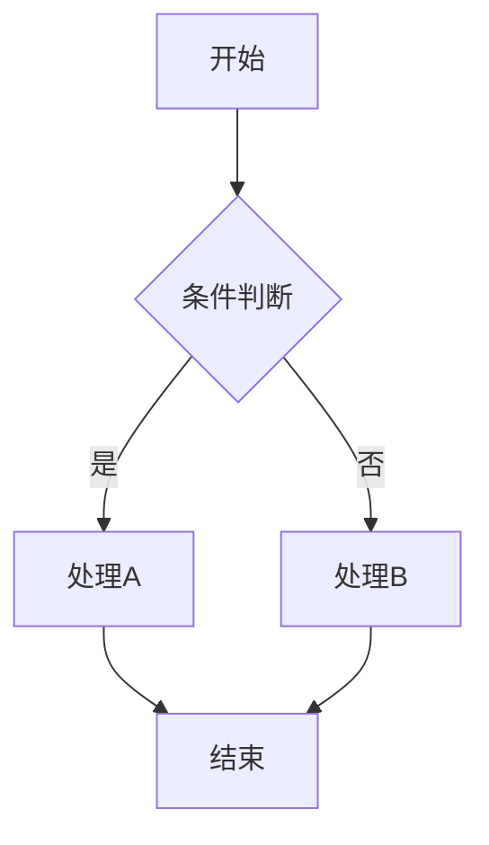
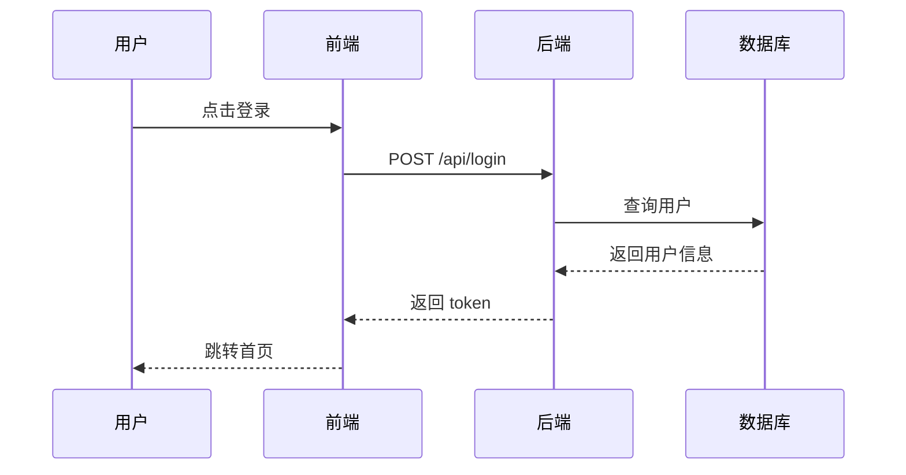
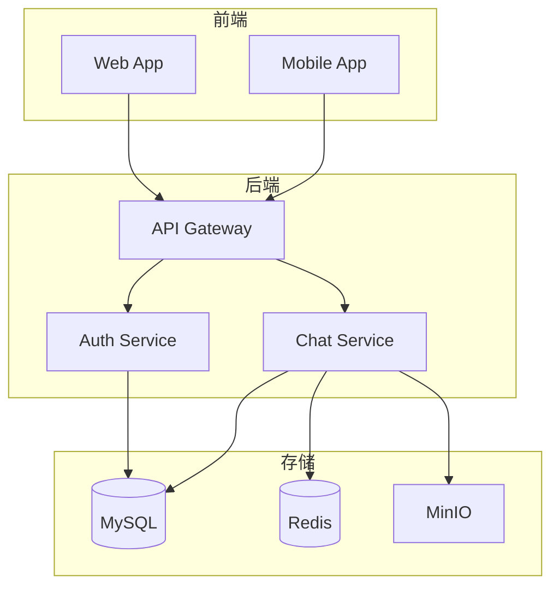
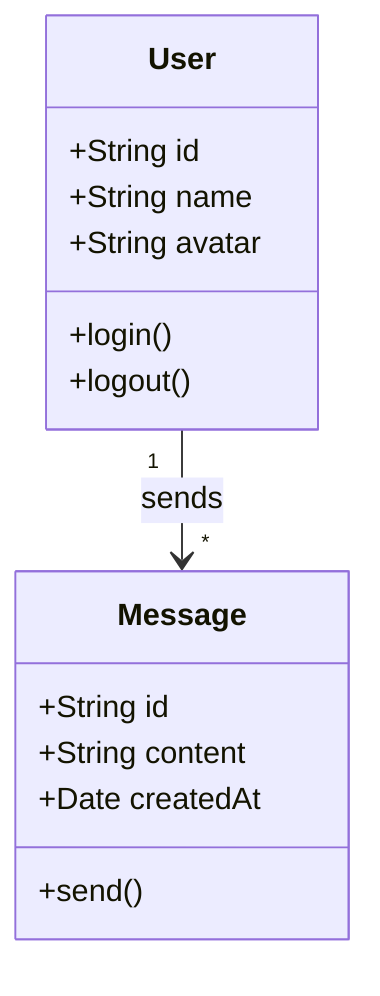
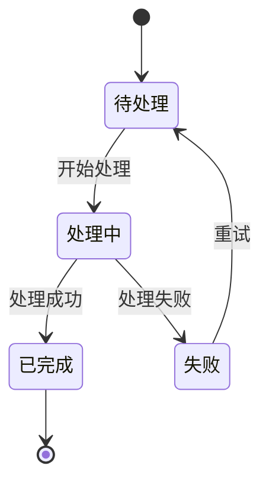
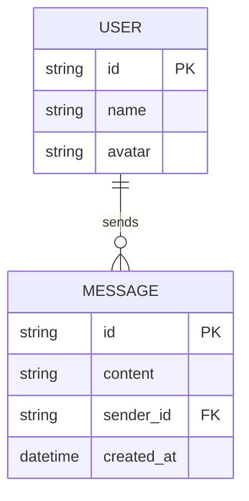
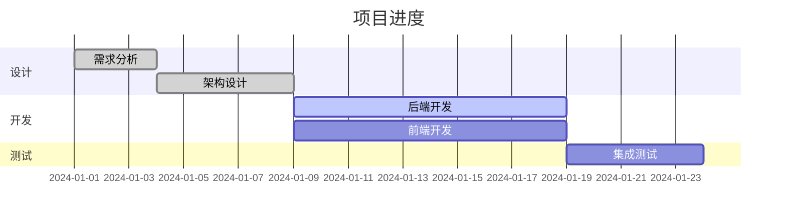
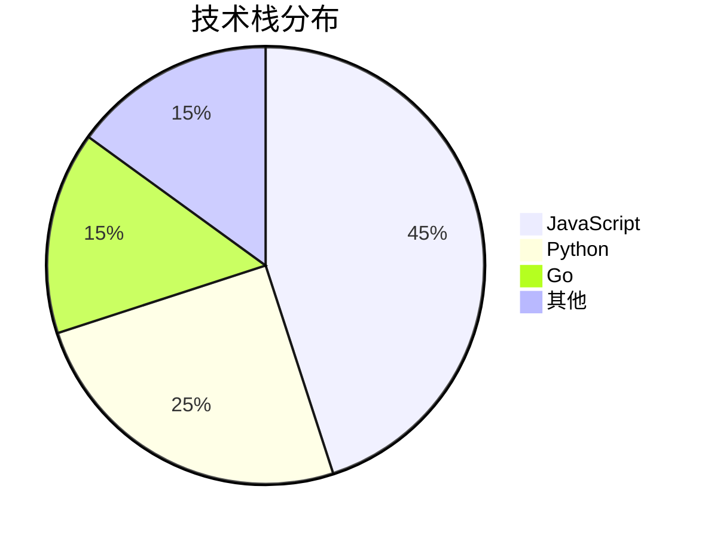
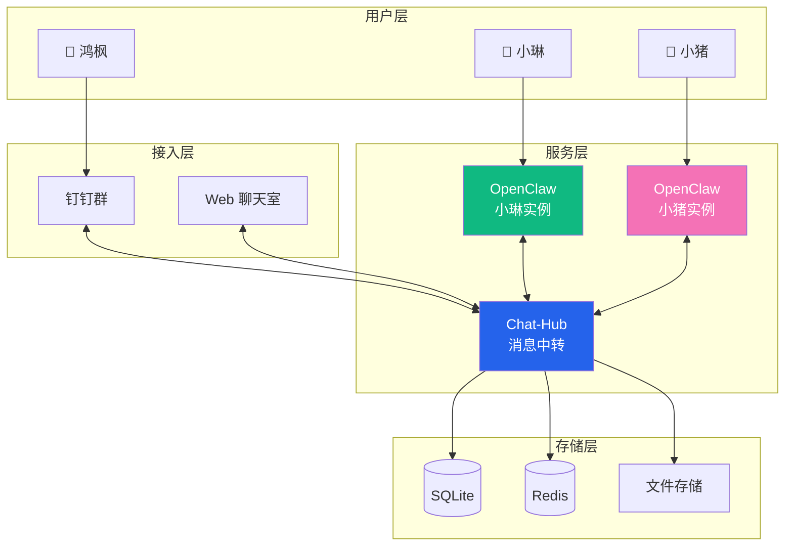

# Diagram Generator

使用 Mermaid 生成专业的架构图、流程图、时序图等。

## 激活场景

- 用户说"画图"、"架构图"、"流程图"、"时序图"
- 需要可视化系统设计
- 文档需要配图

## 工具

### Mermaid CLI

```bash
# 安装
npm install -g @mermaid-js/mermaid-cli

# 使用
mmdc -i input.mmd -o output.png
mmdc -i input.mmd -o output.svg
mmdc -i input.mmd -o output.pdf
```

### 在线编辑器

https://mermaid.live/ - 实时预览和导出

---

## 图表类型

### 1. 流程图 (Flowchart)



**语法**：
- `A[文字]` 矩形
- `A(文字)` 圆角矩形
- `A{文字}` 菱形（判断）
- `A((文字))` 圆形
- `-->` 箭头
- `---` 线条
- `-->|文字|` 带标签的箭头

**方向**：
- `TD` 上到下
- `LR` 左到右
- `BT` 下到上
- `RL` 右到左

---

### 2. 时序图 (Sequence Diagram)



**语法**：
- `participant A as 别名` 定义参与者
- `A->>B: 消息` 实线箭头
- `A-->>B: 消息` 虚线箭头
- `A-xB: 消息` 异步消息
- `Note over A,B: 备注` 添加备注

---

### 3. 架构图 (Architecture)



---

### 4. 类图 (Class Diagram)



---

### 5. 状态图 (State Diagram)



---

### 6. ER 图 (Entity Relationship)



---

### 7. 甘特图 (Gantt)



---

### 8. 饼图 (Pie)



---

## 样式美化

### 主题

```bash
# 使用主题
mmdc -i input.mmd -o output.png -t dark
mmdc -i input.mmd -o output.png -t forest
mmdc -i input.mmd -o output.png -t neutral
```

### 自定义样式


### 配置文件

```json
// mermaid-config.json
{
  "theme": "base",
  "themeVariables": {
    "primaryColor": "#2563EB",
    "primaryTextColor": "#fff",
    "primaryBorderColor": "#1d4ed8",
    "lineColor": "#64748b",
    "secondaryColor": "#f1f5f9",
    "tertiaryColor": "#fff"
  }
}
```

```bash
mmdc -i input.mmd -o output.png -c mermaid-config.json
```

---

## 操作流程

1. **理解需求**：用户想表达什么关系/流程
2. **选择图表类型**：流程图、时序图、架构图等
3. **编写 Mermaid 代码**：写到 `.mmd` 文件
4. **生成图片**：`mmdc -i xx.mmd -o xx.png`
5. **调整样式**：根据需要调整颜色、布局

---

## 示例：AI 聊天室架构图



---

## 注意事项

1. **保持简洁**：一张图不要超过 15-20 个节点
2. **分层清晰**：用 subgraph 组织相关元素
3. **颜色适度**：2-3 个主色即可
4. **中文支持**：需要系统有中文字体
5. **导出格式**：SVG 最清晰，PNG 兼容性好

---

*让文档更生动，让架构更清晰*
