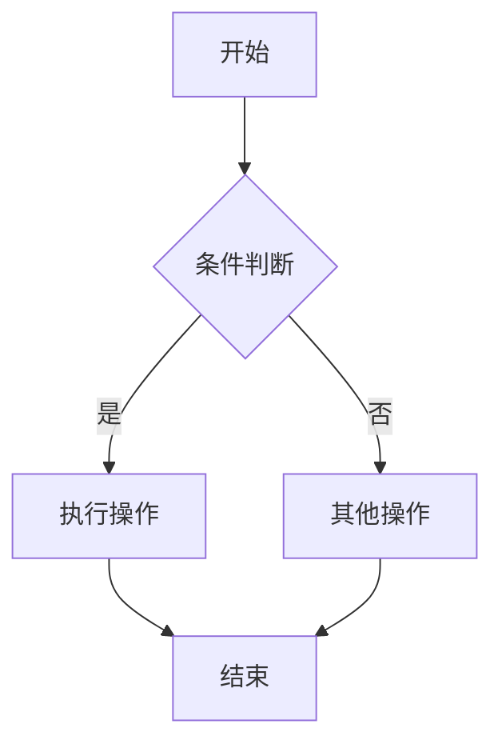
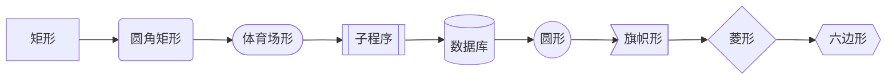
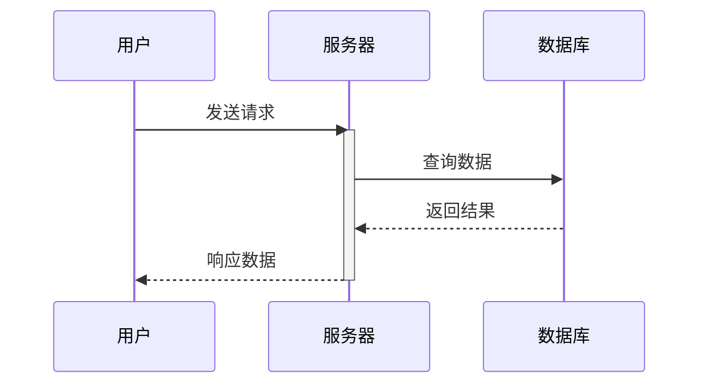
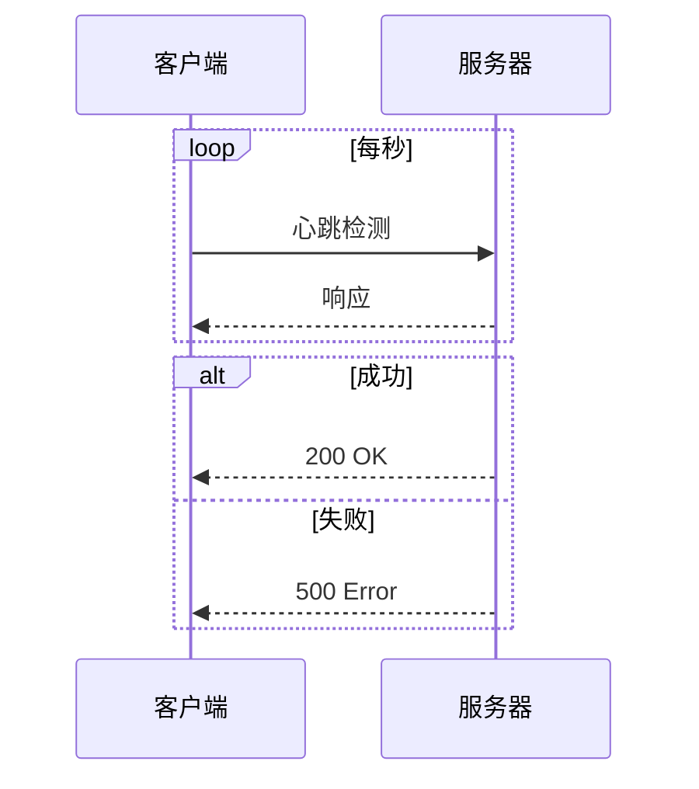
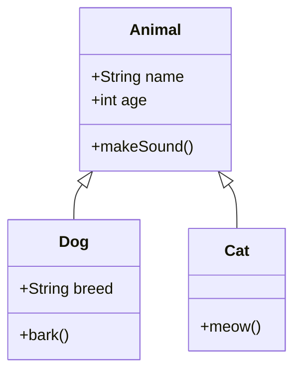
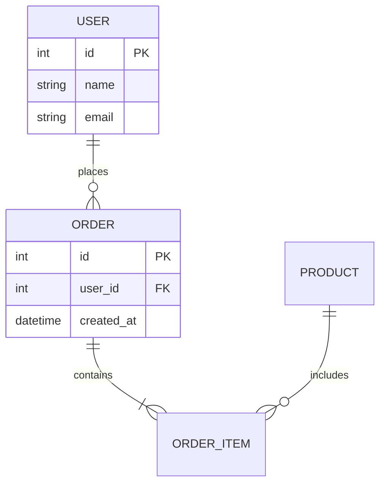
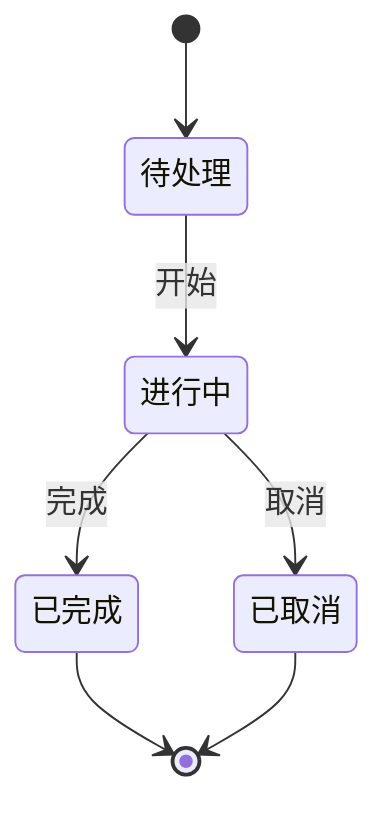
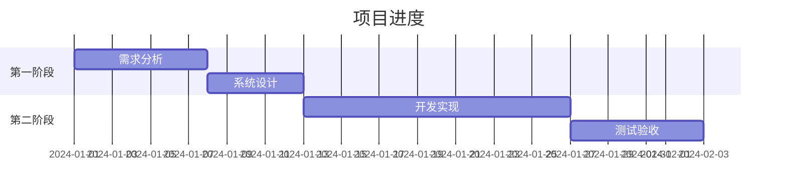
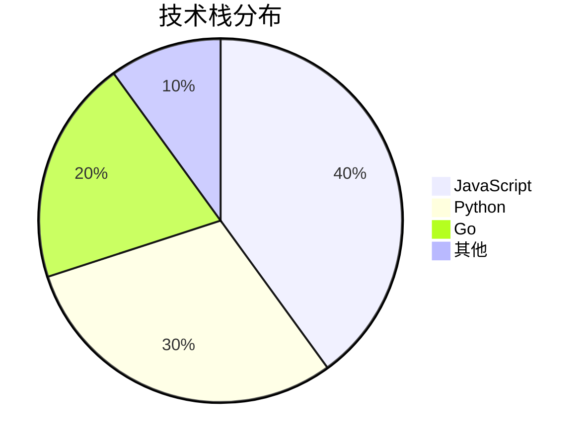

# Mermaid 绘图技能

使用 Mermaid 生成各类图表，适用于技术文档、架构设计、流程说明等场景。

## 支持的图表类型

| 类型 | 语法 | 适用场景 |
|:-----|:-----|:---------|
| 流程图 | `flowchart` | 业务流程、算法逻辑 |
| 时序图 | `sequenceDiagram` | API 交互、消息流程 |
| 类图 | `classDiagram` | 数据模型、OOP 设计 |
| ER 图 | `erDiagram` | 数据库设计 |
| 状态图 | `stateDiagram-v2` | 状态机、生命周期 |
| 甘特图 | `gantt` | 项目进度、时间线 |
| 饼图 | `pie` | 数据分布、占比 |
| 架构图 | `C4Context` | 系统架构 |

---

## 流程图（Flowchart）

### 基本语法



### 方向

| 方向 | 说明 |
|:-----|:-----|
| `TD` / `TB` | 从上到下 |
| `BT` | 从下到上 |
| `LR` | 从左到右 |
| `RL` | 从右到左 |

### 节点形状



### 样式


---

## 时序图（Sequence Diagram）

### 基本语法



### 箭头类型

| 箭头 | 说明 |
|:-----|:-----|
| `->` | 实线无箭头 |
| `-->` | 虚线无箭头 |
| `->>` | 实线带箭头 |
| `-->>` | 虚线带箭头 |
| `-x` | 实线带叉 |
| `--x` | 虚线带叉 |

### 循环和条件



---

## 类图（Class Diagram）



---

## ER 图（Entity Relationship）



---

## 状态图（State Diagram）



---

## 甘特图（Gantt）



---

## 饼图（Pie）



---

## 生成图片

### 安装工具

```bash
npm install -g @mermaid-js/mermaid-cli
```

### 生成命令

```bash
# 生成 PNG
mmdc -i diagram.mmd -o diagram.png

# 生成 SVG（推荐）
mmdc -i diagram.mmd -o diagram.svg

# WSL 环境
PUPPETEER_EXECUTABLE_PATH=/usr/bin/chromium-browser mmdc -i diagram.mmd -o diagram.png
```

### Puppeteer 配置

```json
// puppeteer-config.json
{
  "args": ["--no-sandbox", "--disable-setuid-sandbox"]
}
```

```bash
mmdc -i diagram.mmd -o diagram.png -p puppeteer-config.json
```

---

## 常见问题

### Q: 中文乱码
**A**: 安装中文字体
```bash
sudo apt-get install fonts-wqy-microhei
fc-cache -fv
```

### Q: 找不到 Chromium
**A**: 安装并设置环境变量
```bash
sudo apt-get install chromium-browser
export PUPPETEER_EXECUTABLE_PATH=/usr/bin/chromium-browser
```

---

*技能作者：小琳 ✨*
